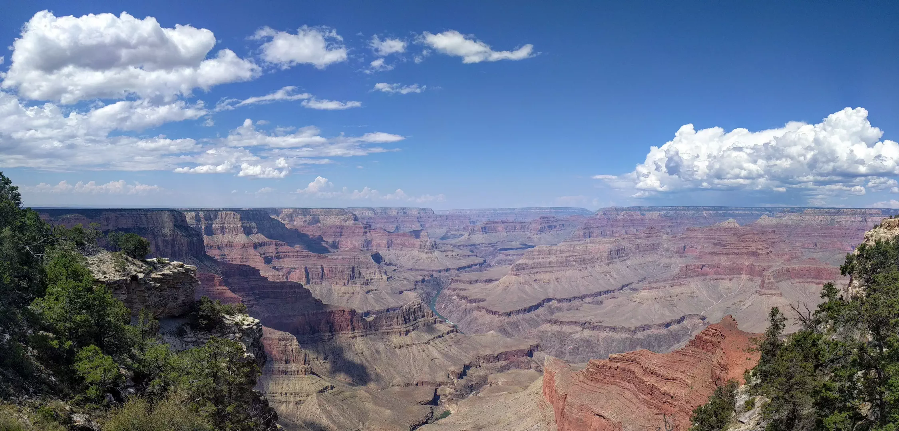

# Travels in the Southwest Colorado Plateau

A week spent road-tripping to [Arches](https://www.nps.gov/arch/index.htm), [Grand Canyon](https://www.nps.gov/grca/index.htm), and [Bryce Canyon](https://www.nps.gov/brca/index.htm) National Parks, and a few more spots in between.

## Arches National Park

Looking north after ascending to the plateau that makes up the majority of Arches National Park. This is well before the first of the arches that are accessible from the main road.

Looking east after ascending into Arches National Park. The first arches are in the far distance; in the mid-distance is a field of “fossilized” sand dunes.

Looking south (back towards the park entrance), after ascending into Arches National Park. This is well before the first of the arches that are accessible from the main road.

Looking west after ascending into Arches National Park (the entrance is below and behind this ridge). This is well before the first arches that are accessible from the main road.

Looking north after ascending into Arches National Park (the entrance is below and behind the ridge at left). This is well before the first arches accessible from the main road.

Looking southwest from the first group of arches accessible from the main road. The arches themselves are off-frame behind, and to the left and right, of this photograph.

The North Window arch, one of the first arches accessible from the main road in Arches National Park.

On the trail around the South Window and North Window arches, two of the first arches accessible from the main road in Arches National Park.

On the trail around the South and North Window arches, two of the first arches accessible from the main road in Arches National Park. Len Montgomery is head of me.

Looking southeast from the trail around the South Window and North Window arches, two of the first arches accessible from the main road in Arches National Park.

One of the many lizards of Arches National Park. Taken on the trail around the South and North Window arches, two of the first arches accessible from the main road.

The Double Arch, imaged with the wide-angle feature of the Android camera. These two arches were formed from a sinkhole in the containing mesa.

Looking southwest from under the Double Arch, imaged with the wide-angle feature of the Android camera. Len Montgomery is siting in the foreground, near the center of the frame.

Len Montgomery (on the left side of the frame), sitting near the Garden of Eden, a series of eroded rock ridges and towers.

Looking east from near the Garden of Eden, a series of eroded rock ridges and towers.

Looking north from the aptly named Panorama Point, about halfway into Arches National Park.

Looking southeast from near the entrance of Arches National Park. The visitor center is just off the right side of the frame, with the main body of the park to the left.

Looking east towards the sunrise, about halfway into Arches National Park (just before the turnoff for Delicate Arch).

Looking east towards the sunrise, about halfway into Arches National Park (just before the turnoff for Delicate Arch).

Tunnel Arch, the first major arch on the Devil’s Garden Trail in Arches National Park. A smaller “sinkhole” arch (formed in a similar process as Double Arch) is left-of-center.

Looking north through Pine Tree Arch, the second major arch on the Devil’s Garden Trail at the end of the main road in Arches National Park.

Looking northwest through Pine Tree Arch, the second major arch on the Devil’s Garden Trail at the end of the main road in Arches National Park.

Looking east from the “other side” (i.e., opposite the trail) of Pine Tree Arch, the second major arch on the Devil’s Garden Trail at the end of the main road in Arches National Park.

Looking back towards the trail through Pine Tree Arch. If you look closely, you’ll see Len Montgomery standing in the bushes towards the lower right.

Nathan Acks, photographing Len Montgomery, photographing me at the Pine Tree Arch, the second major arch on the Devil’s Garden Trail at the end of the main road in Arches National Park.

Landscape Arch, just west of the Devil’s Garden Trail in Arches National Park.

Landscape Arch, just west of the Devil’s Garden Trail in Arches National Park.

Heading south on the trail towards Sand Dune Arch, in Arches National Park.

Sand Dune Arch, in Arches National Park.

Len Montgomery approaches the south side of Broken Arch, in Arches National Park.

The north side of Broken Arch (looking south), in Arches National Park.

Delicate Arch as seen from the Upper Viewpoint in Arches National Park. If you look closely, you can see all of the hikers that hiked the trail to Delicate Arch itself.

## The Grand Canyon

Looking west along the Grand Canyon from near Hermit’s Rest. The Colorado River is visible near center.

Looking east along the Grand Canyon from near Hermit’s Rest. A sliver of the Colorado River is visible in the lower left.

A tarantula hawk feeds on flower on the South Rim of the Grand Canyon near Hermit’s Rest.

A tarantula hawk feeds on flower on the South Rim of the Grand Canyon near Hermit’s Rest.

Goldenrod Soldier Beetles, taken about half way between Hermit’s Rest and Hopi Point along the South Rim Trail.

Goldenrod Soldier Beetles, taken about half way between Hermit’s Rest and Hopi Point along the South Rim Trail.

Looking east along the Grand Canyon from near Hopi Point. The Colorado River is visible near center.

Looking north across the Grand Canyon, somewhere between Hopi and Yavapai Points.

Trees growing just below the South Rim of the Grand Canyon, taken near Yavapai Point.

Looking towards Yaki Point from the Grand Canyon visitor center. Len Montgomery and I hiked later to the Cedar Ridge overlook on the South Kaibab Trail, just above the “temple” in this photo.

Looking back towards a point between the South Kaibab Trail Head and Mather Point from the South Kaibab Trail.

Len Montgomery, ahead of me on the South Kaibab Trail.

Looking down towards the Cedar Ridge overlook and across the Grand Canyon from the South Kaibab Trail near Ooh Aah Point.

Len Montgomery poses near the Ooh Aah Point on the South Kaibab Trail.

Len Montgomery and I take our obligatory vacation selfie near the Ooh Aah Point on the South Kaibab Trail.

Looking east across the Grand Canyon shortly after dawn.

Looking northeast across the Grand Canyon shortly after dawn.

Looking north across the Grand Canyon.

Looking east across the Grand Canyon from the Desert View Watchtower. The Colorado River can be seen entering the Grand Canyon at the far left.

## Sunset Crater

Sunset Crater, a volcanic cone less than a thousand years old, just south of the Grand Canyon. It’s the youngest volcano in the San Francisco Volcanic Field.

The San Francisco Peaks, the remains of a massive stratovolcano that exploded in a northeasterly direction (towards where I’m standing) about 200,000 years ago.

Looking across the Bonito Lava Flow, just northwest of Sunset Crater.

The east side of Sunset Crater.

A small plant grows in the lava flow east of Sunset Crater.

## Glen Canyon Dam

The Glen Canyon Dam, with the artificial Lake Powell extending behind it.

At left, the Glen Canyon Dam with the artificial Lake Powell extending behind it. At right, the Glen Canyon Dam Bridge, with the Colorado River below.

The Glen Canyon Dam, with the artificial Lake Powell extending behind it.

# Horseshoe Bend

Horseshoe Bend is in Grand Canyon National Park (the park begins at the top of the rim walls and extends to the Glen Canyon Dam), but the overlook I’m on is BLM land.

Horseshoe Bend is in Grand Canyon National Park (the park begins at the top of the rim walls and extends to the Glen Canyon Dam), but the overlook I’m on is BLM land.

A small flowering bush clings to the cliff just above Horseshoe Bend.

The Colorado River snakes southeast from Horseshoe Bend.

## Bryce Canyon

Solar panels near the Bryce Canyon visitors center.

Looking northeast from Rainbow Point on the south side of Bryce Canyon.

Looking northwest from Rainbow Point towards the main extent of Bryce Canyon.

Looking northeast from Rainbow Point on the south side of Bryce Canyon.

Looking east from the rim wall of Bryce Canyon, just north of Rainbow Point.

Looking southeast from the rim wall of Bryce Canyon, just north of Rainbow Point.

Looking southeast from the rim wall of Bryce Canyon, just north of Rainbow Point.

Looking north from the rim wall of Bryce Canyon, just north of Rainbow Point.

Looking east through the Bryce Natural Bridge, just north of Rainbow Point.

Looking southeast from the rim wall of Bryce Canyon, just north of Rainbow Point.

Looking east from the rim wall of Bryce Canyon, just north of Rainbow Point.

Looking east through Swamp Canyon from the rim wall of Bryce Canyon.

Looking southeast from Sunrise Point from the rim wall of Bryce Canyon; the Queen’s Garden Trail Head is just off frame to the left.

Looking northeast from Sunrise Point from the rim wall of Bryce Canyon; the Queen’s Garden Trail Head is just off frame to the right.

Looking southeast into Bryce Canyon from just south of Sunrise Point.

A tree on the Bryce Canyon rim, about half way between Sunrise and Sunset Points.

Looking southeast into Bryce Canyon from just between Sunrise and Sunset Points.

Looking east into Bryce Canyon from Sunset Point.

Looking southeast into Bryce Canyon from the lower Inspiration Point.

Looking across Bryce Canyon from between the upper and lower Inspiration Points; the main “amphitheater” of Bryce Canyon can be seen to the left.

## The Road Home

The hotel that Len Montgomery and I stayed at on the way back to Denver from Bryce Canyon provided a rubber ducky with the normal toiletries!

So green that Len Montgomery couldn’t stop laughing.

- - - -

👤 Nathan Acks
📅 September 16, 2017
