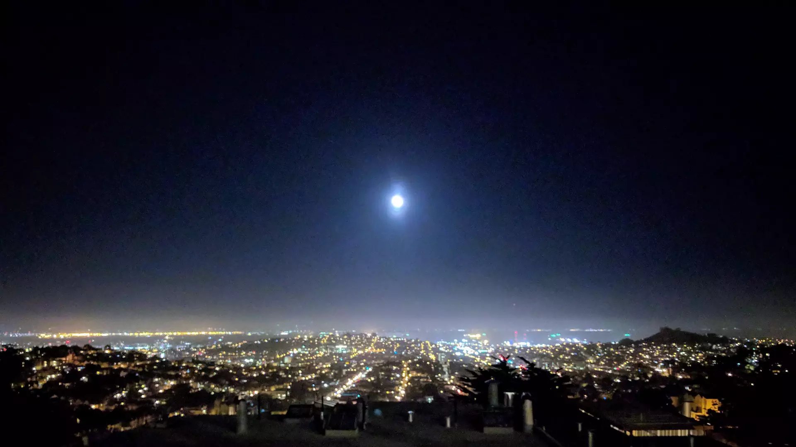

# Coast to Coast

A combination of astute planning and sheer luck/misfortune saw me traveling from San Francisco, to Louisville, Kentucky, to Washington, DC over the course of two and a half weeks.

## San Francisco

A spider in Redwood Regional Park.

There were a surprising number of spiders in the park… And surprisingly few birds.

Taken in Redwood Regional Park during a hike with Len Montgomery, Nathaniel Manista, Stephen Ulrich, Mike, and Daniel (Mike and Daniel are two of Stephen Ulrich’s friends).

The Moon rises over San Francisco Bay. Looking inland from Krista Stone-Manista and Nathaniel Manista’s condo. The San Francisco city core is just off-frame to the left.

The San Francisco after dinner crew.

The orrery at [The Interval](https://theinterval.org/), which is run by [The Long Now](https://longnow.org/).

Takeoff from SFO, en route to Louisville, Kentucky. The San Francisco Bay is in the background, and the shadow of my plane can be seen on the ground near center.

A view of part of SFO from the air, taken shortly after takeoff.

## Louisville

Clouds at sunset over the midwest.

The University of Louisville. Ryen Schimerman & Jasmine Chiang’s apartment, where I stayed while in Kentucky, was just a couple of blocks from the University.

The old water tower on top of Ryen Schimerman & Jasmine Chiang’s apartment building, where I stayed while in Louisville.

The deck on top of Ryen Schimerman & Jasmine Chiang’s apartment building, where I stayed while in Louisville. This particular photo makes for a rather nice phone wallpaper if you’re into textured photos.

An animated GIF of a train pulling through the east side of the University of Louisville.

A train pulls through the east side of the University of Louisville.

Detail of a train pulling through the east side of the University of Louisville.

Detail of a train pulling through the east side of the University of Louisville.

The Big Four Bridge over the Ohio River. The far shore is Indiana.

The Abraham Lincoln (foreground) and John F. Kennedy Memorial (background) Bridges over the Ohio River. The far shore is Indiana.

An empty coal barge approaches the Big Four Bridge on the Ohio River. Indiana is on the left, Kentucky on the right.

An empty coal barge about to pass under the Big Four Bridge on the Ohio River. Indiana is on the left, Kentucky on the right.

An empty coal barge passing under the Big Four Bridge across the Ohio River. The Abraham Lincoln (near) and John F. Kennedy Memorial (far) Bridges lie ahead.

An empty coal barge passing under the Abraham Lincoln (foreground) and John F. Kennedy Memorial (background) Bridges. Downtown Louisville lies beyond.

Looking east across the Ohio River just after sunrise. The left-hand shore is Indiana, and the right-hand shore Kentucky.

Looking south towards Kentucky from near the middle of the Big Four Bridge.

Looking north towards Indiana from near the middle of the Big Four Bridge.

The Abraham Lincoln (foreground) and John F. Kennedy Memorial (background) Bridges over the Ohio River. The far shore is Indiana.

The Abraham Lincoln (foreground) and John F. Kennedy Memorial (background) Bridges over the Ohio River, processed with Prisma.

The pedestrian on-ramp to the Big Four Bridge in Louisville, Kentucky.

The Abraham Lincoln Bridge over the Ohio River; the John F. Kennedy Memorial Bridge is just past it, and beyond that the Clark Memorial Bridge. The far shore is Indiana.

The Abraham Lincoln Bridge over the Ohio River; the John F. Kennedy Memorial Bridge is just past it, and beyond that the Clark Memorial Bridge. The far shore is Indiana.

Beneath the Abraham Lincoln Bridge over the Ohio River, looking towards Indiana. The John F. Kennedy Memorial Bridge can be seen at left.

Beneath the Abraham Lincoln Bridge over the Ohio River, looking towards Indiana. The John F. Kennedy Memorial Bridge can be seen at left.

## Washington, DC

The entrance to the Library of Congress’ James Madison Memorial Building at night.

Pedestrians on the east side of the US Capitol.

Morning on the east side of the US Capitol.

The entrance to the Supreme Court of the United States.

The fountain in front of the Library of Congress.

- - - -

👤 Nathan Acks
📅 October 23, 2017
