# Pat & Emily’s Wedding

photographer:: Nathan Acks  
date:: 2017-11-11

Photos from my friends’ Pat Kelly-Fischer and Emily Kelly-Fischer’s wedding near Winter Park, Colorado. This set of photos sold me on the power of the combination of the Pixelbook’s pen and Adobe Photoshop Lightroom CC.

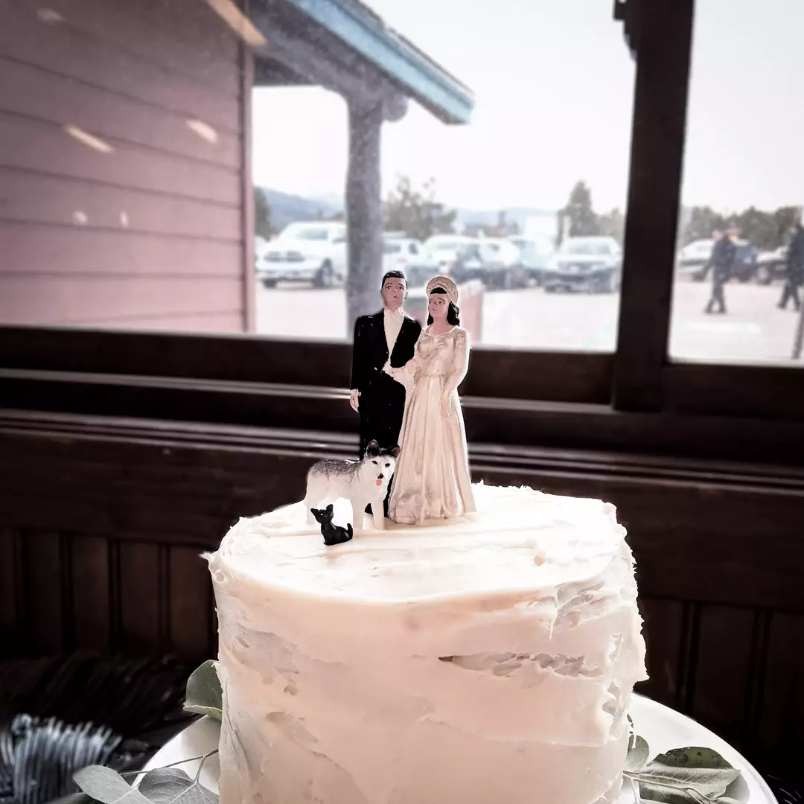

Pat Kelly-Fischer & Emily Kelly-Fischer’s wedding cake. The figurines are Emily Kelly-Fischer’s grandmother’s (the dog and cat, for Hudson and Blackbeard respectively, are new). Emily Kelly-Fischer baked the cake herself.

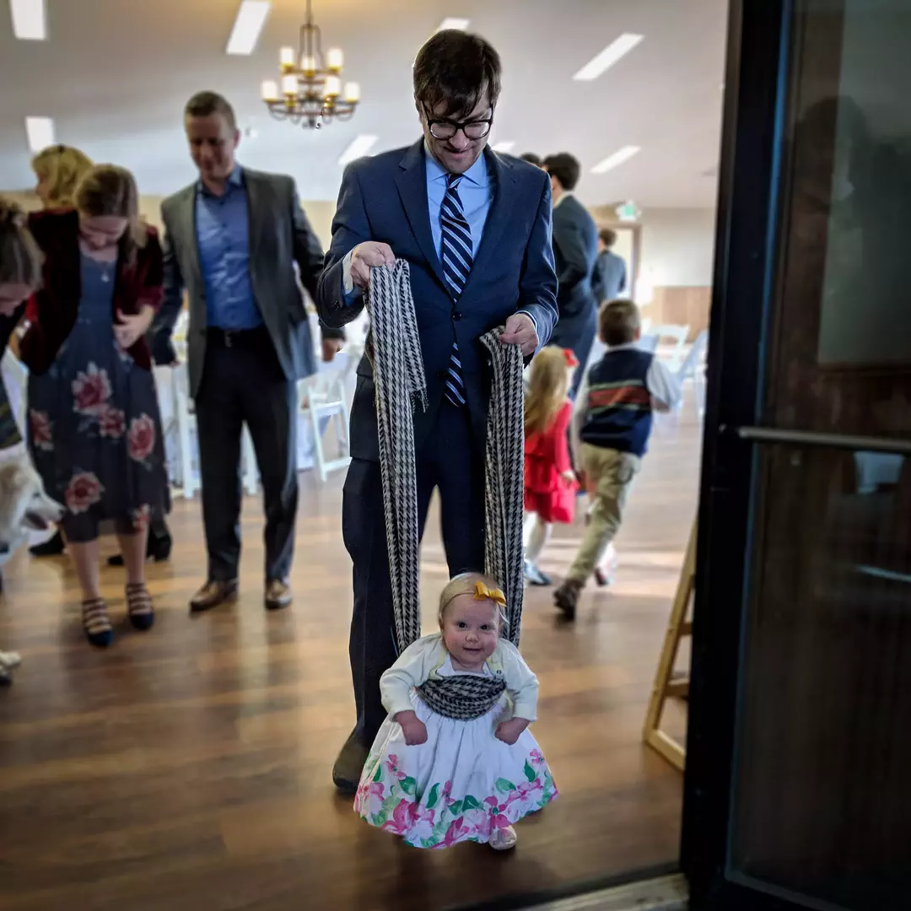

David Rossini takes his daughter Eliza Chafetz Rossini for a walk just after Pat Kelly-Fischer & Emily Kelly-Fischer’s wedding ceremony. (She wasn’t quite able to walk on her own at this point, hence the support.)

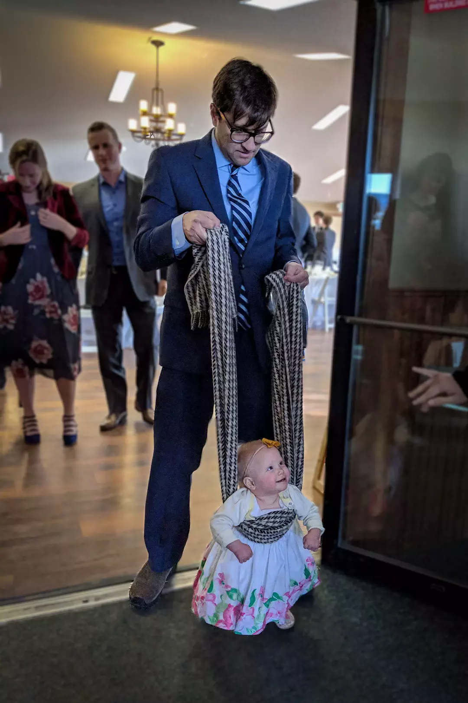

David Rossini takes his daughter Eliza Chafetz Rossini for a walk just after Pat Kelly-Fischer & Emily Kelly-Fischer’s wedding ceremony. (She wasn’t quite able to walk on her own at this point, hence the support.)

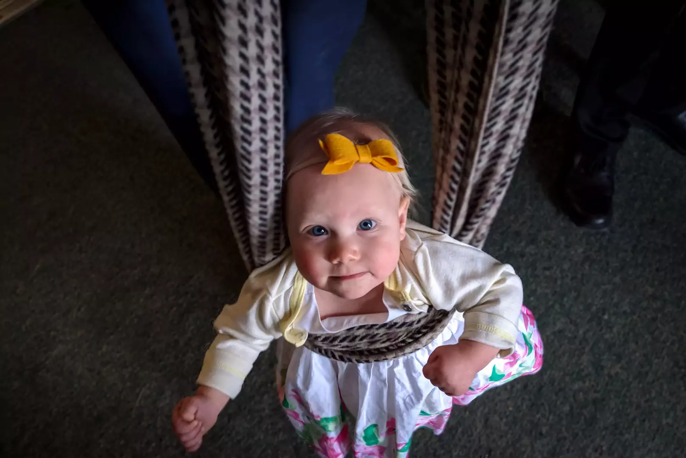

Eliza Chafetz Rossini poses for the camera just after Pat Kelly-Fischer & Emily Kelly-Fischer’s wedding ceremony.

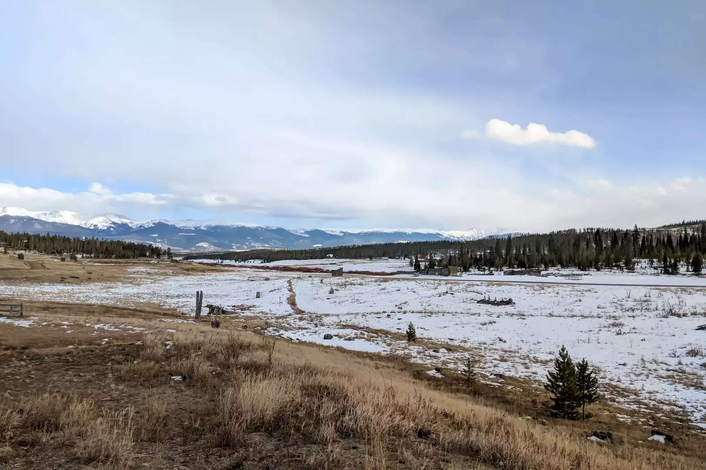

Looking east from the building in Snow Mountain Ranch where Pat Kelly-Fischer & Emily Kelly-Fischer were married.

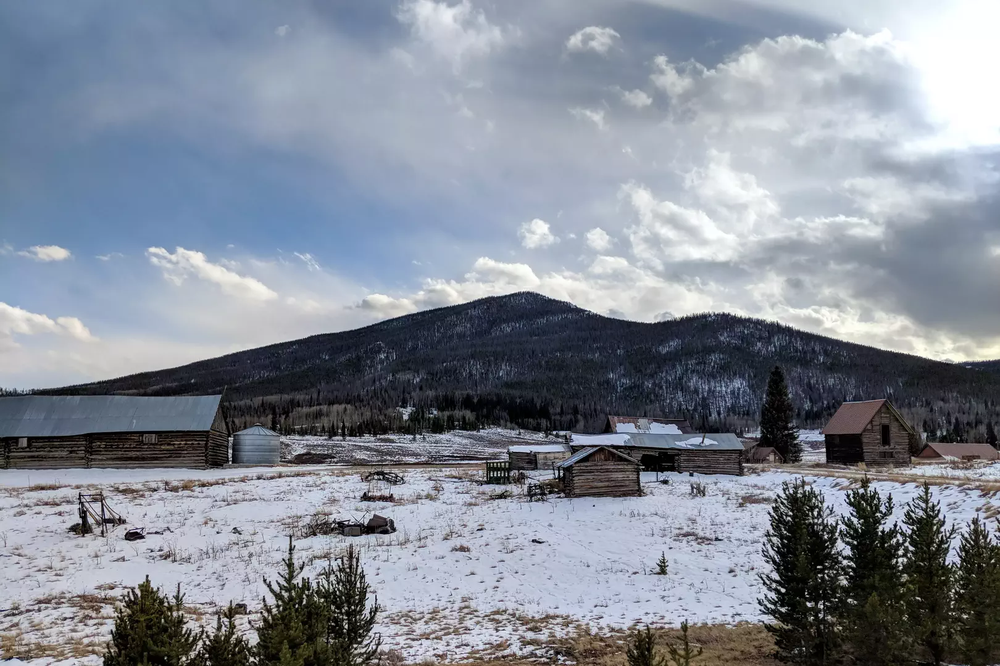

Looking south towards Sheep Mountain from the building in Snow Mountain Ranch where Pat Kelly-Fischer & Emily Kelly-Fischer were married.

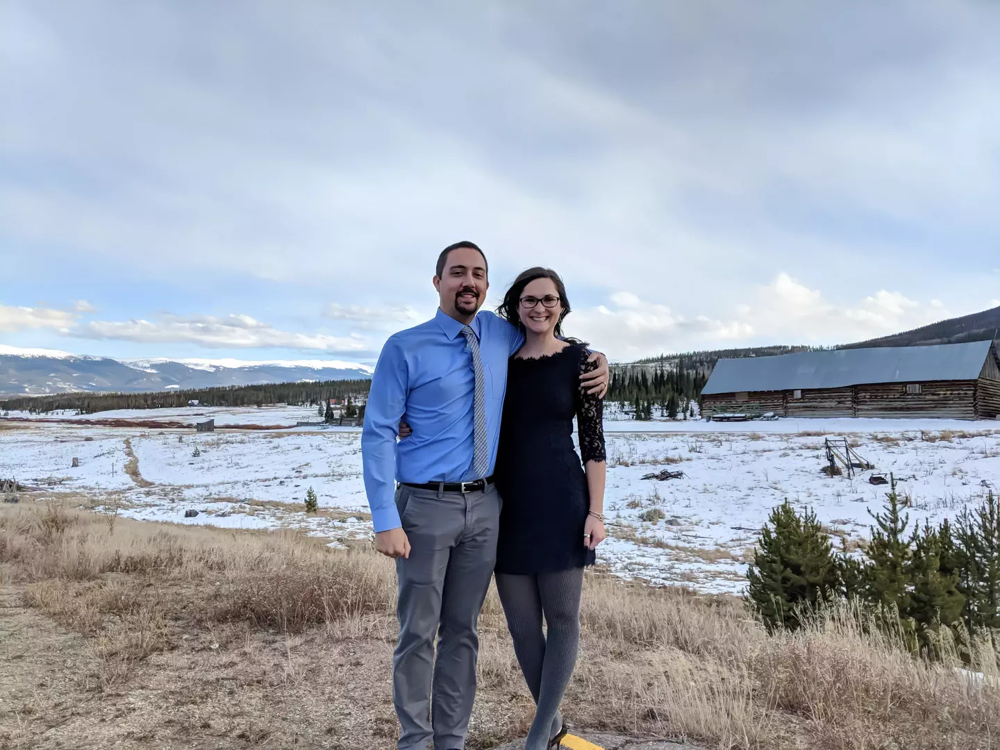

Mitch Singeltary & Rhiannon Singeltary at Snow Mountain Ranch.

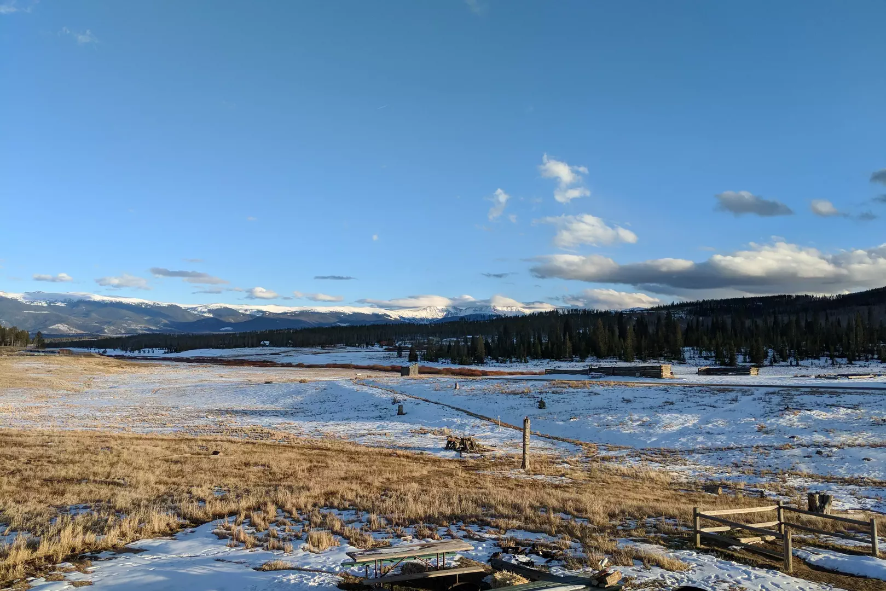

Looking east just before sunset. Not the best photo, but it’s interesting to compare with the next one, which was taken almost an hour later from the same spot.

Looking east just after sunset from the building in Snow Mountain Ranch where Pat Kelly-Fischer & Emily Kelly-Fischer were married.

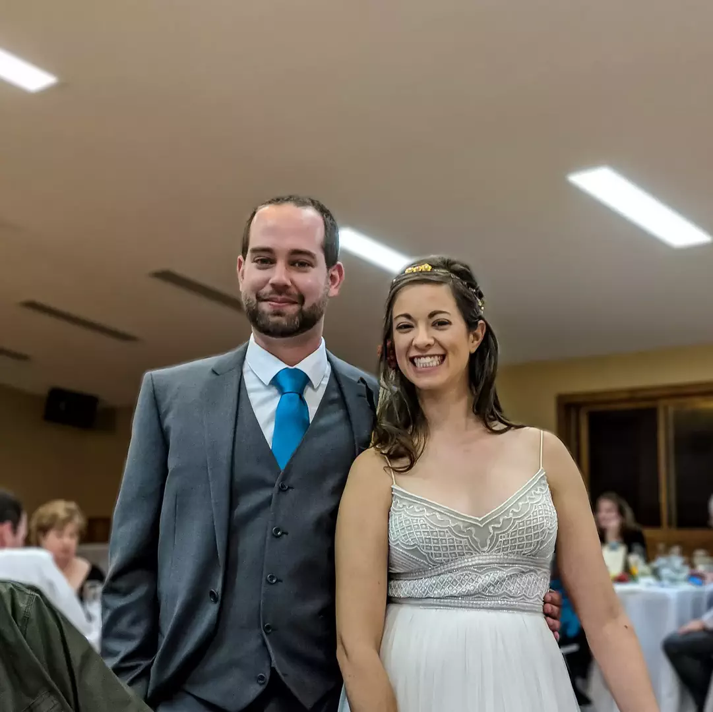

Pat Kelly-Fischer & Emily Kelly-Fischer at their wedding reception.

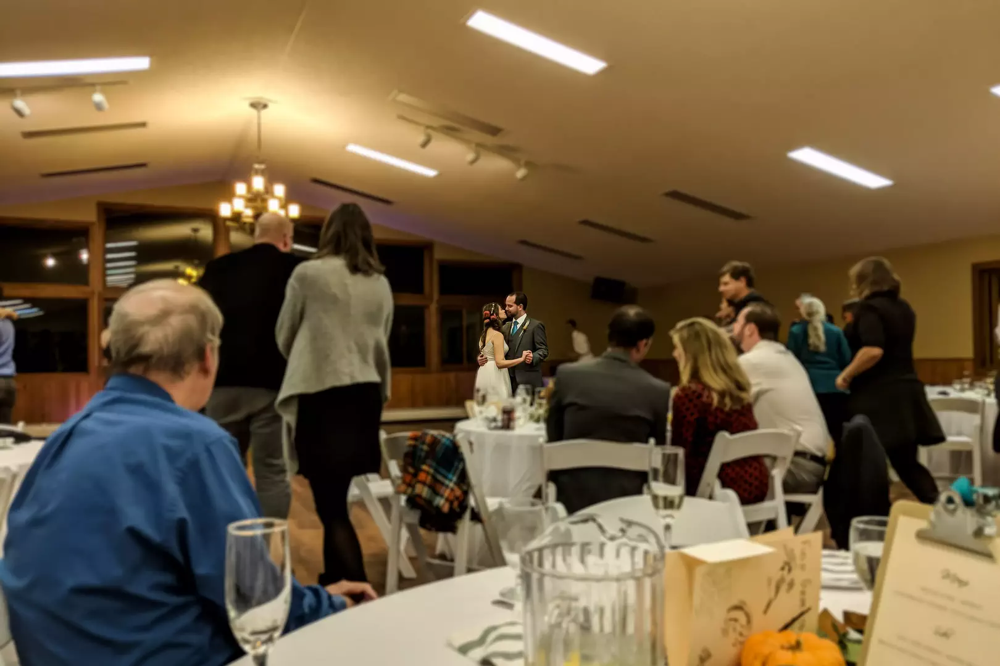

Pat Kelly-Fischer & Emily Kelly-Fischer take the first dance at their wedding reception.

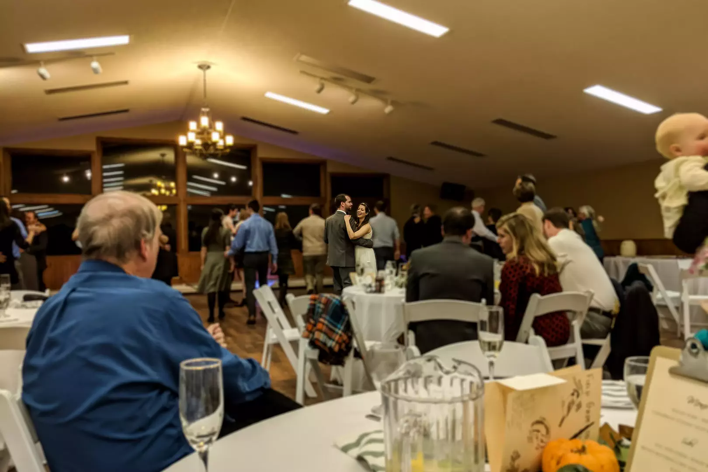

Pat Kelly-Fischer & Emily Kelly-Fischer dance at their wedding reception.

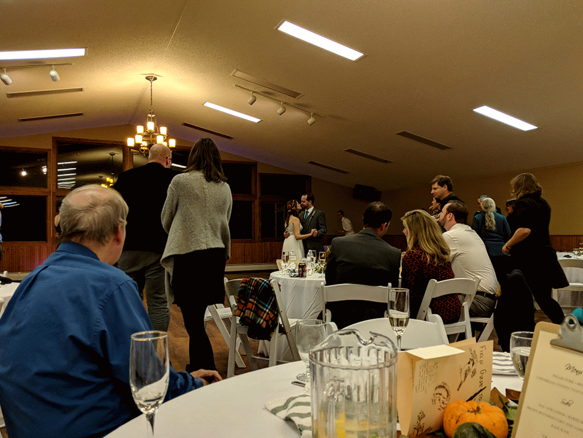

Pat Kelly-Fischer & Emily Kelly-Fischer dance during their wedding reception.

* [Adobe Lightroom: Photo Editor](https://play.google.com/store/apps/details?id=com.adobe.lrmobile)
