# Aspen, CO

Photos from the 2017 TPIN Aspen retreat/vacation. The vacation was fun (though I got sick during the second half), but what struck me the most was how little snow was on the ground this year… Far less than I’ve ever seen in December this late in the year.

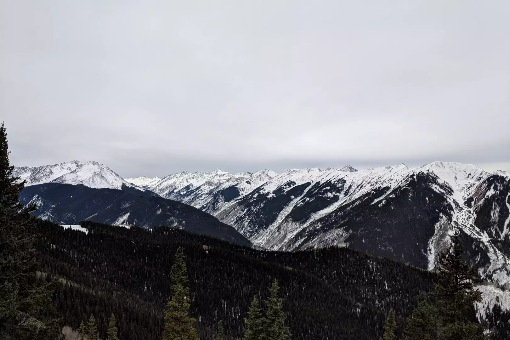

Looking southwest from the summit of Aspen Mountain. Highland Bowl is visible on the right side of the frame.

A panorama looking south (left) to southwest (right) from the summit of Aspen Mountain. Highland Bowl is visible just right of center.

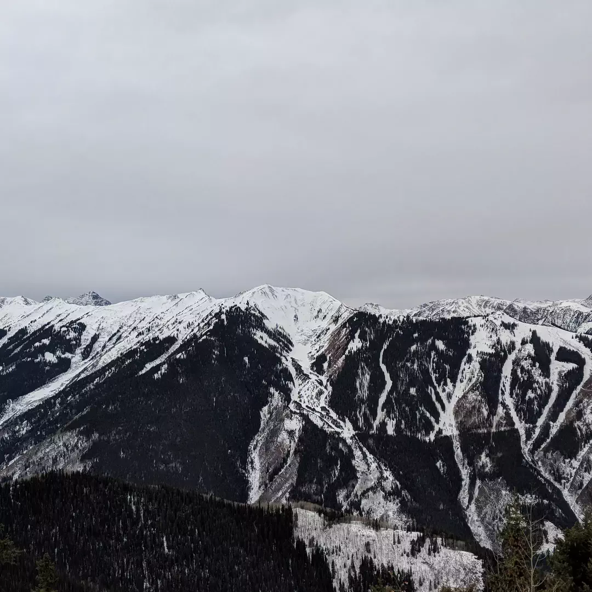

Highland Bowl from the summit of Aspen Mountain; normally Highland Bowl is completely filled with snow by this time.

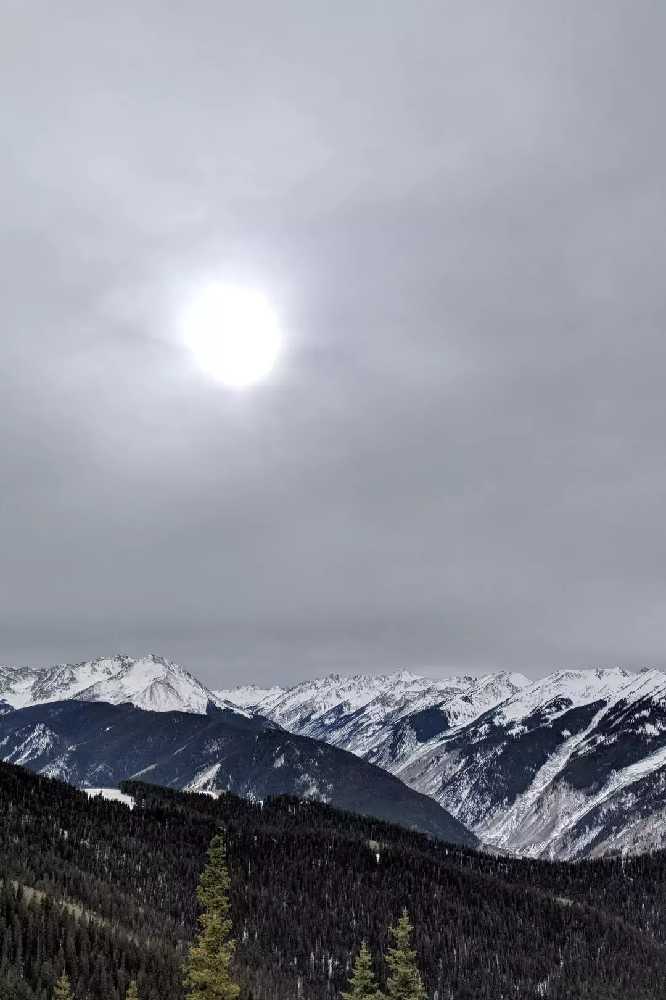

Looking south from the summit of Aspen Mountain.

A chandelier in the ballroom under the Hotel Regis in Aspen, taken during the 2017 TPIN Aspen Gala.

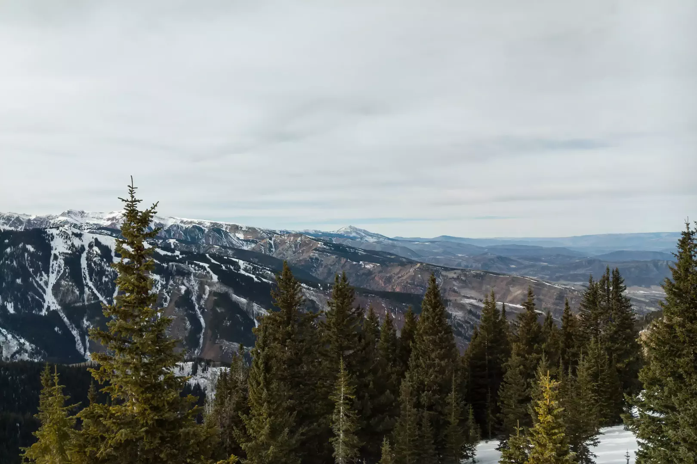

A volcanic peak (whose name I forget), northwest of Aspen Mountain.

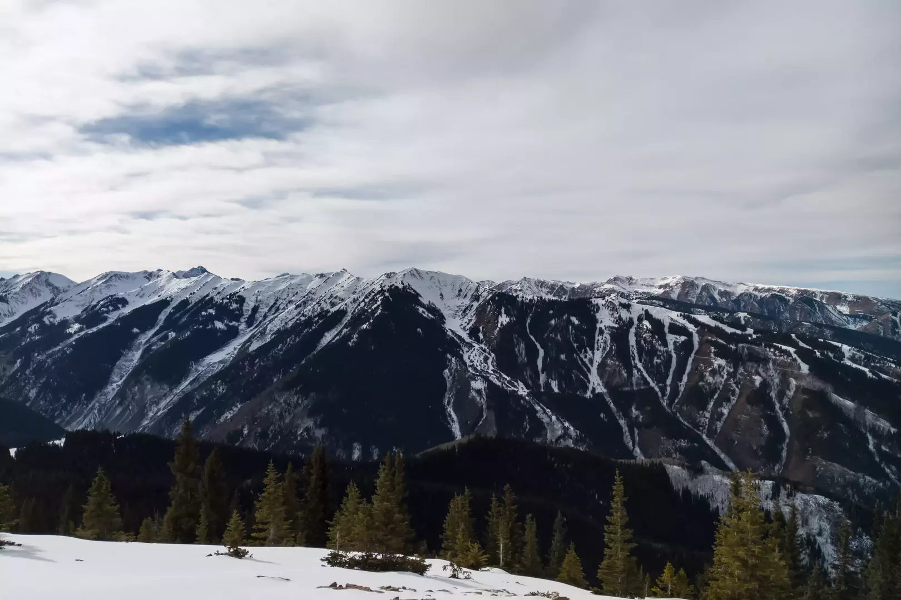

Highland Bowl, as seen from Aspen Mountain.

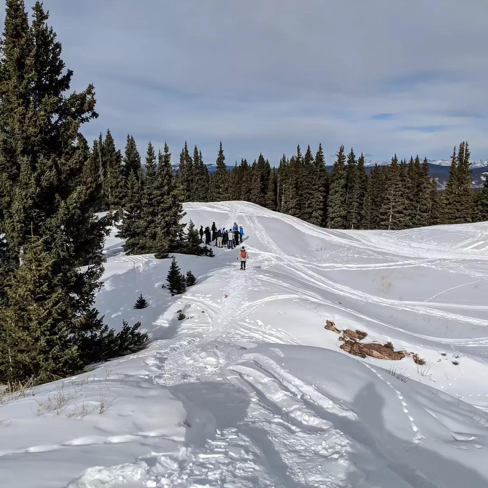

Megan Fitzgerald returns to the snowshoe tour on top of Aspen Mountain.

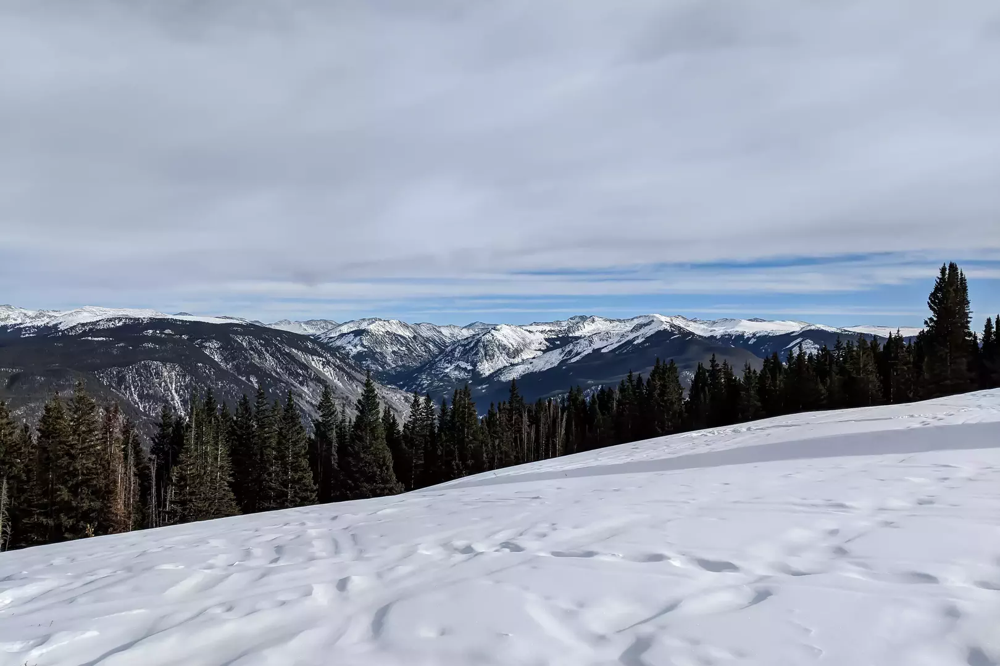

Looking southeast-ish from the top of Aspen Mountain.

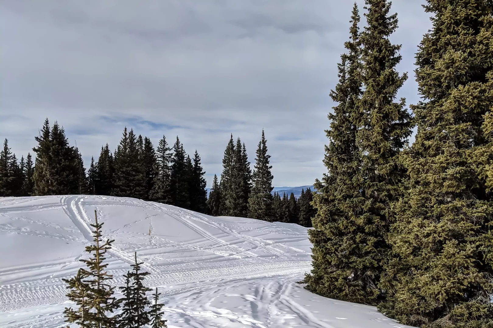

Looking northwest-ish across the top of Aspen Mountain.

Looking south-ish through part of the forest on top of Aspen Mountain.

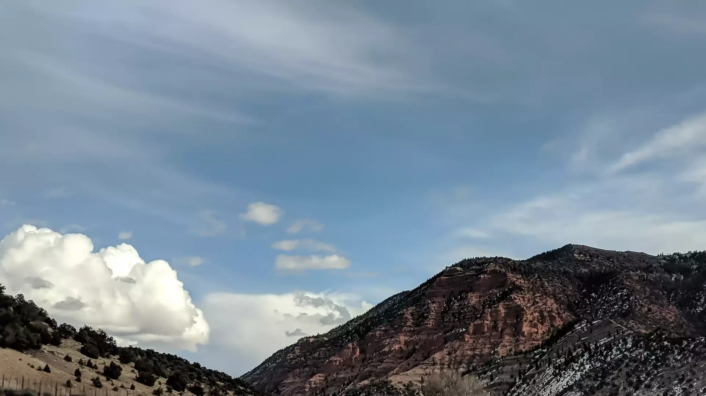

The view from the road back to Denver from Aspen.

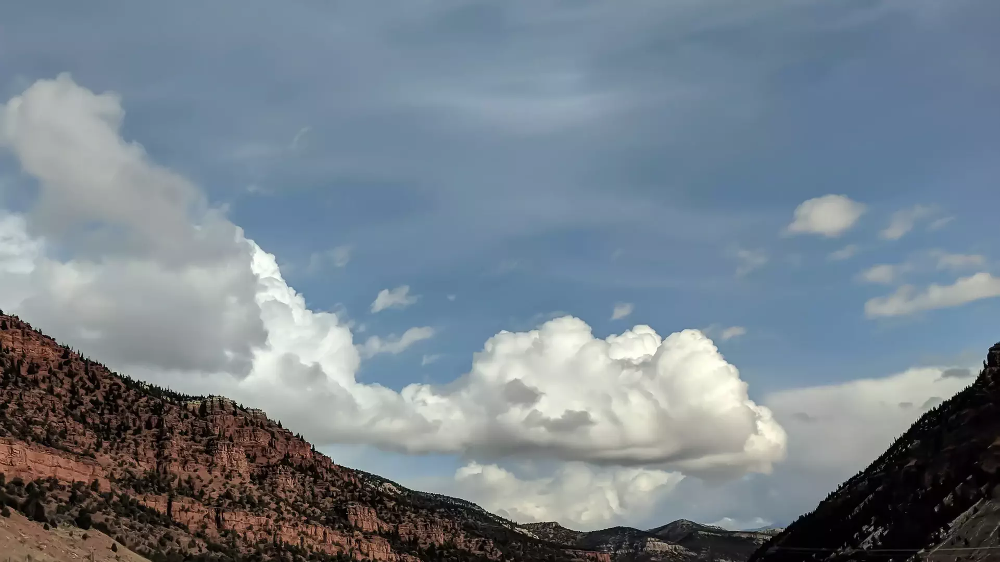

The view from the road back to Denver from Aspen.

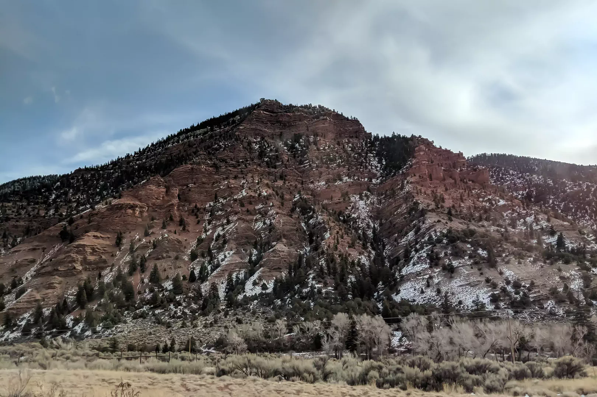

The view from the road back to Denver from Aspen.

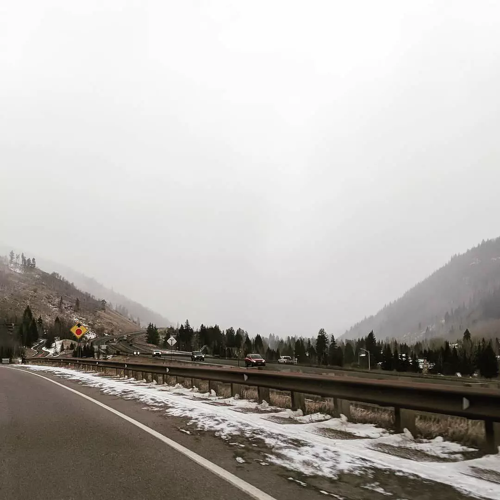

The view from the road back to Denver from Aspen.

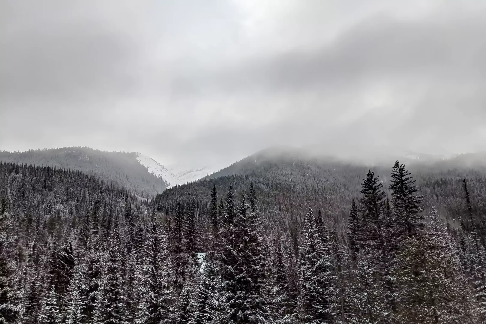

The view from the road back to Denver from Aspen.

- - - -

👤 Nathan Acks  
📅 December 21, 2017
