# Denver Botanic Gardens

Photos from the [Denver Botanic Gardens](https://www.botanicgardens.org/).

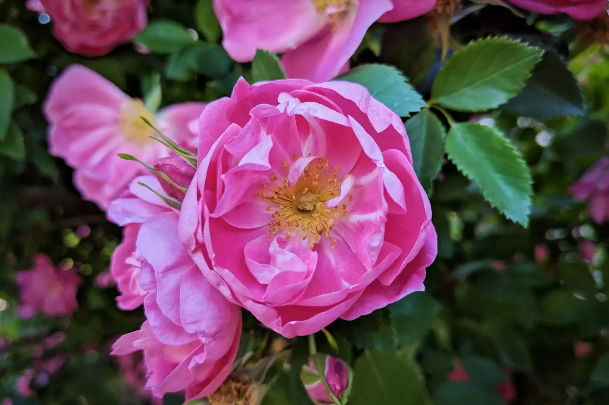

Roses at the Denver Botanic Gardens.

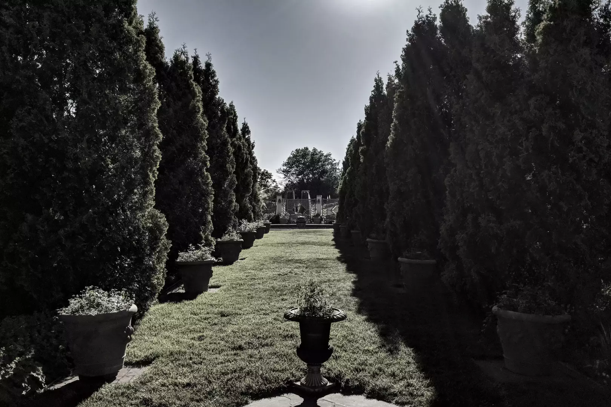

Looking west through the Romantic Gardens at the Denver Botanic Gardens.

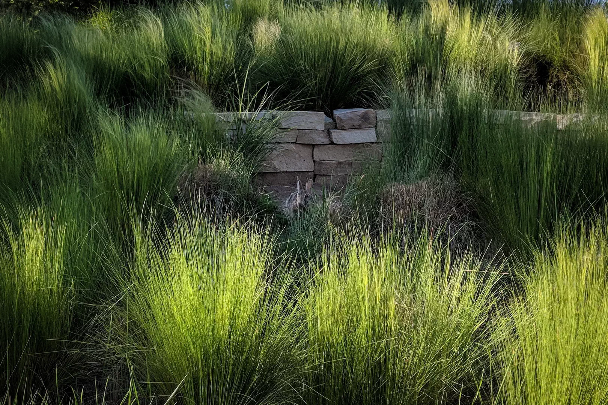

The Denver Botanic Gardens is full of rabbits this year.

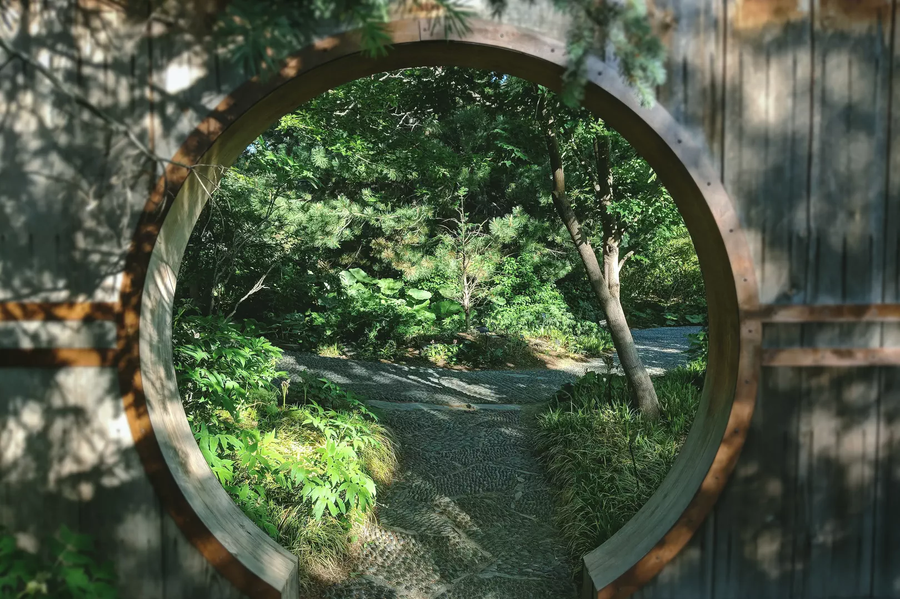

The northwestern gate to June’s PlantAsia at the Denver Botanic Gardens.

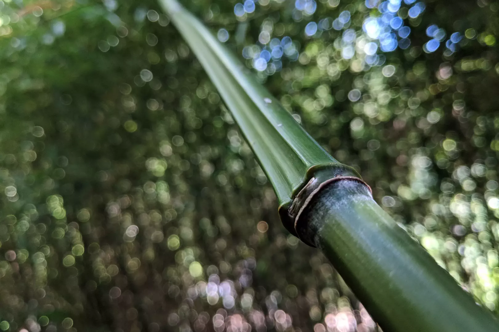

Bamboo in June’s PlantAsia at the Denver Botanic Gardens.

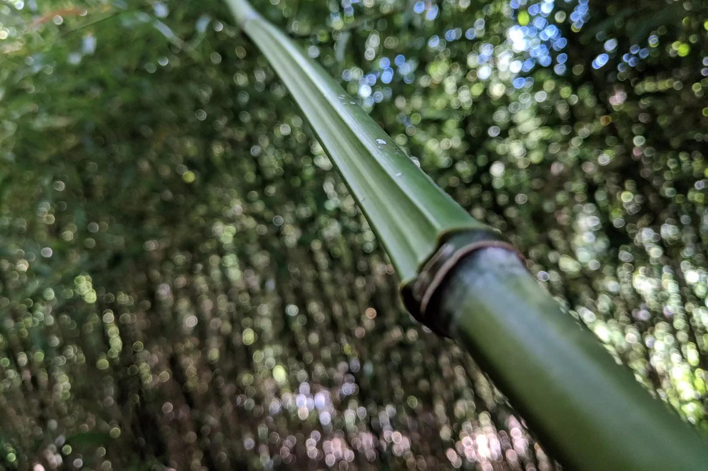

Bamboo in June’s PlantAsia at the Denver Botanic Gardens.

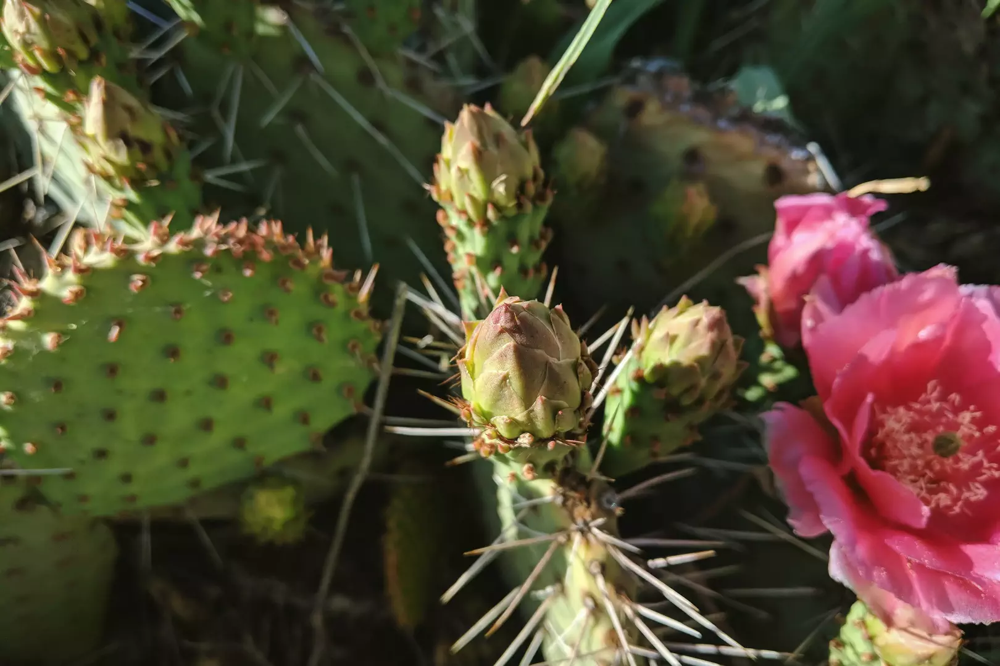

A cactus bud ready to bloom in the Dryland Mesa garden at the Denver Botanic Gardens.

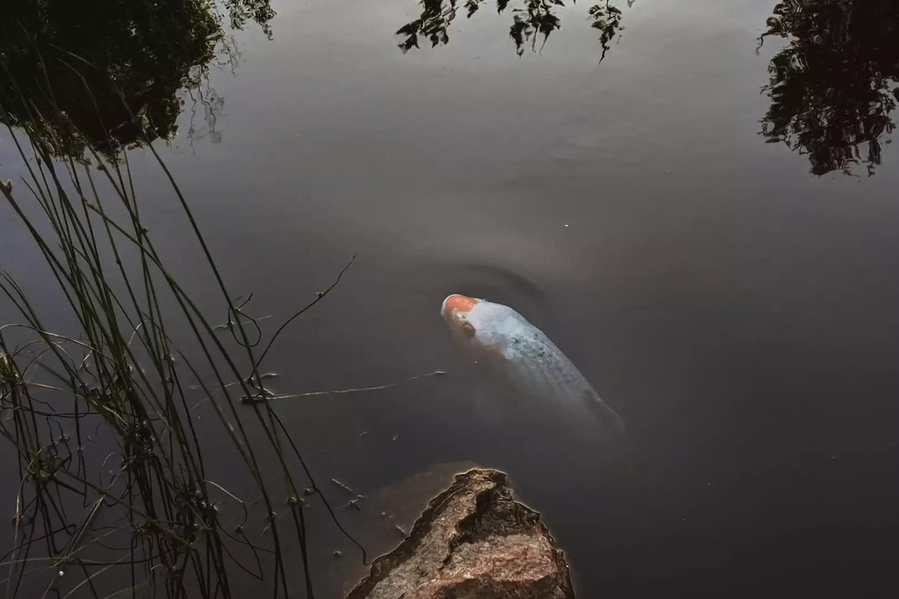

A large koi studies me from the pond between the Gates Montane Garden and the Laura Smith Porter Plains Garden at the Denver Botanic Gardens.

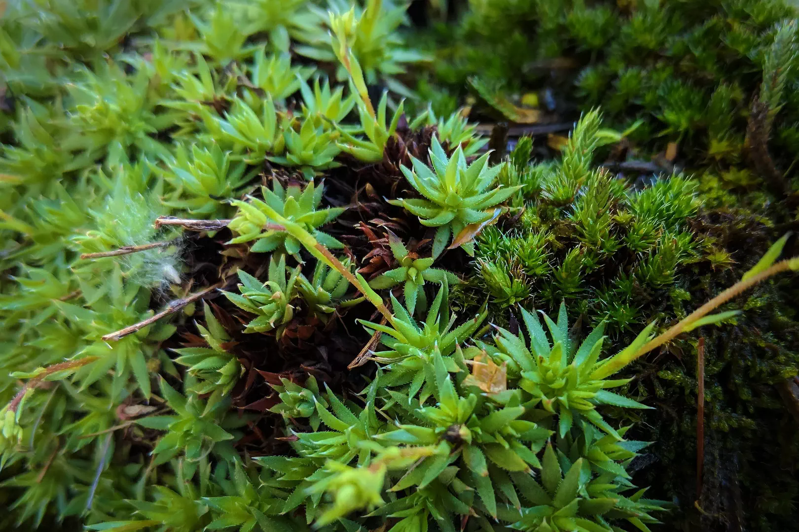

Detail of a small planter in the Bill Hosokawa Bonsai Pavilion at the Denver Botanic Gardens.

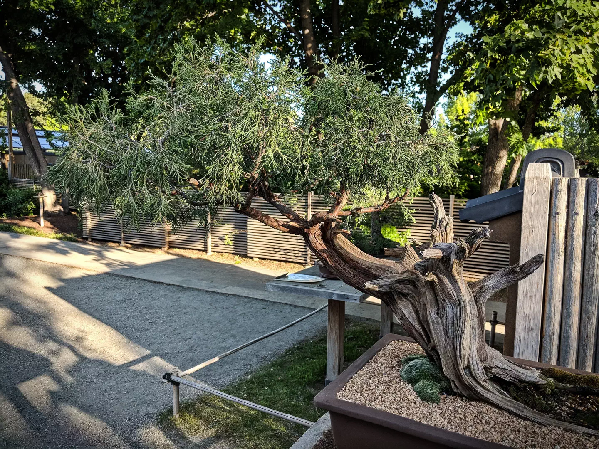

A large Colorado bonsai in the Bill Hosokawa Bonsai Pavilion at the Denver Botanic Gardens.

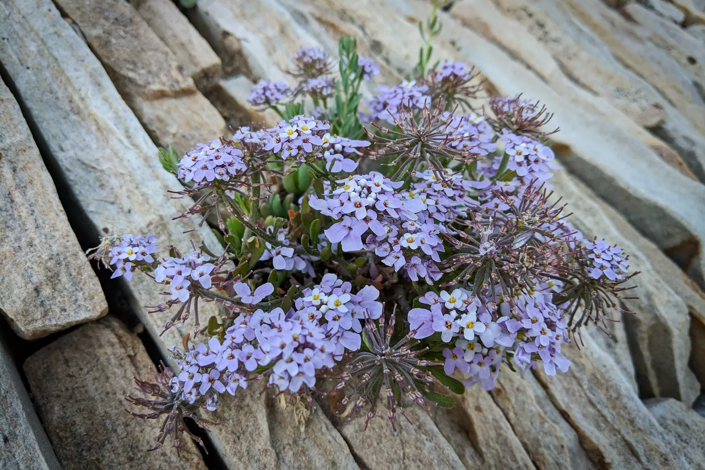

A detail of some flowers growing on the central sculpture/water feature of the Steppe Garden at the Denver Botanic Gardens.

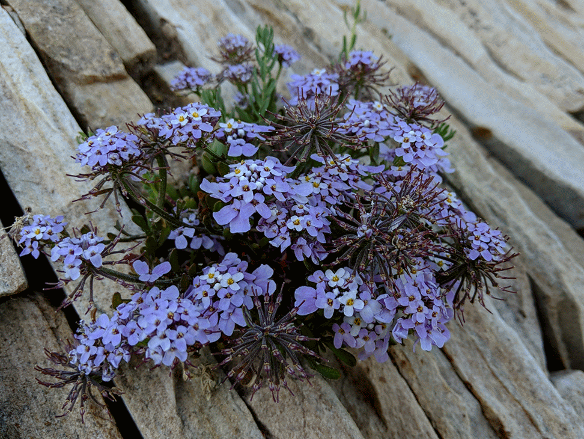

A detail of some flowers growing on the central sculpture/water feature of the Steppe Garden at the Denver Botanic Gardens.

- - - -

👤 Nathan Acks  
📅 June 2, 2018
