# The Circle of HOPE

This year I attended HOPE 12, [The Circle of HOPE](https://xii.hope.net/). “HOPE” stands for “Hackers on Planet Earth”, and is one of the older hacker conferences in the US. It’s put on every other year by the crew from [2600 Magazine](https://www.2600.com/).

Attending HOPE is something I’ve wanted to do for a long time. While I didn’t take any photos in the conference itself, these are a few photos I took around the event.

# Denver to New York

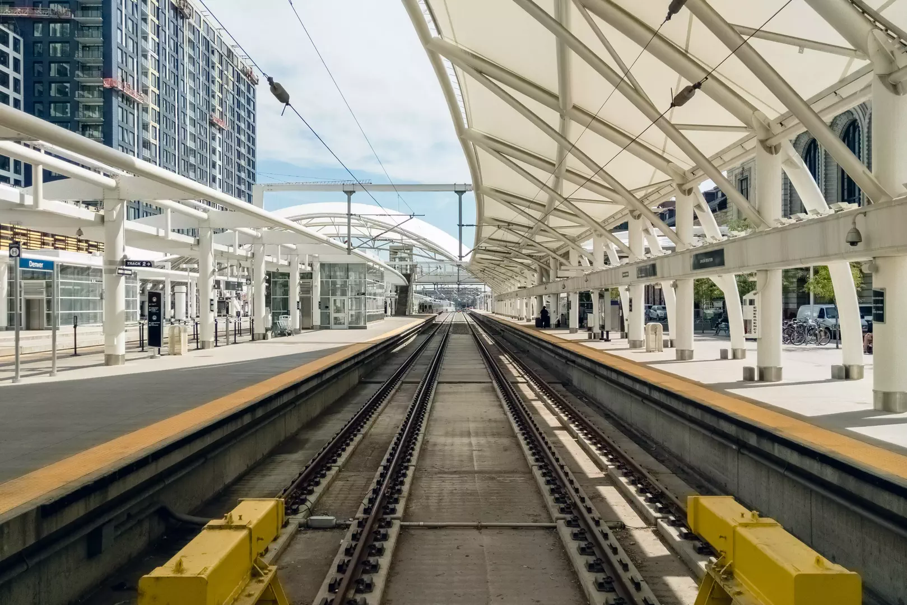

Union Station, Track A, on the way to HOPE 12!

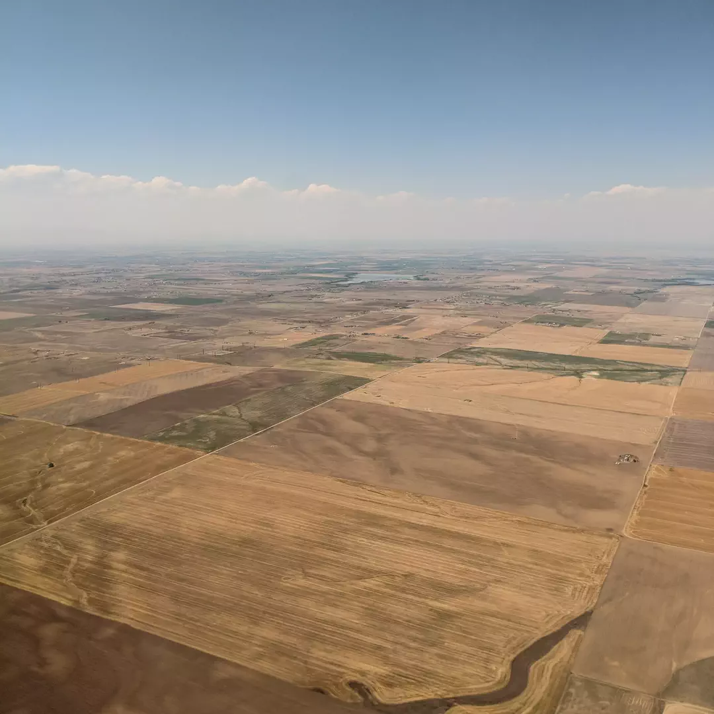

Eastern Colorado from the air, on the way to New York City and HOPE 12.

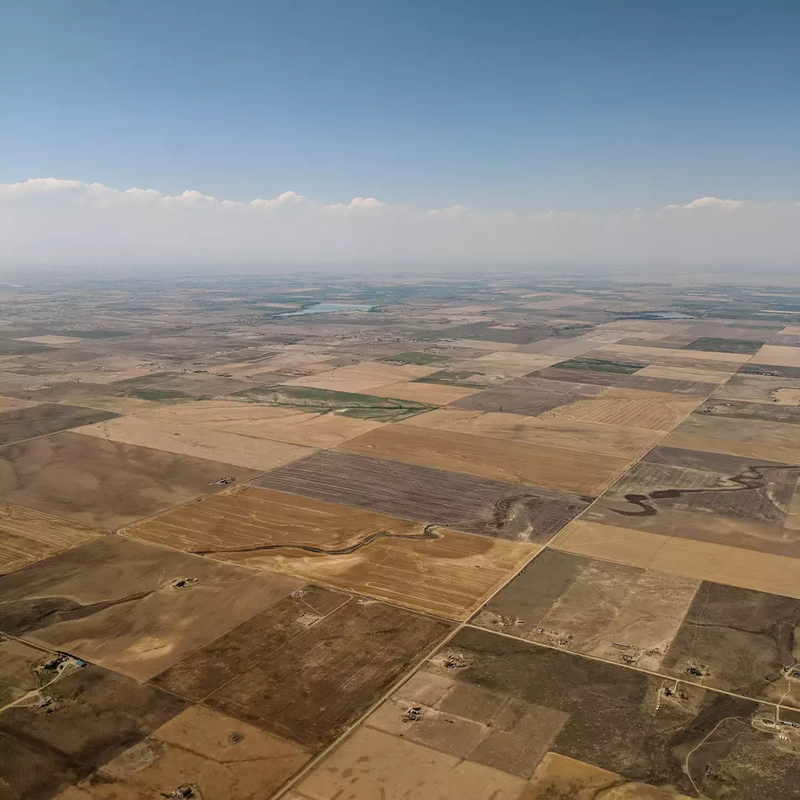

Eastern Colorado from the air, on the way to New York City and HOPE 12.

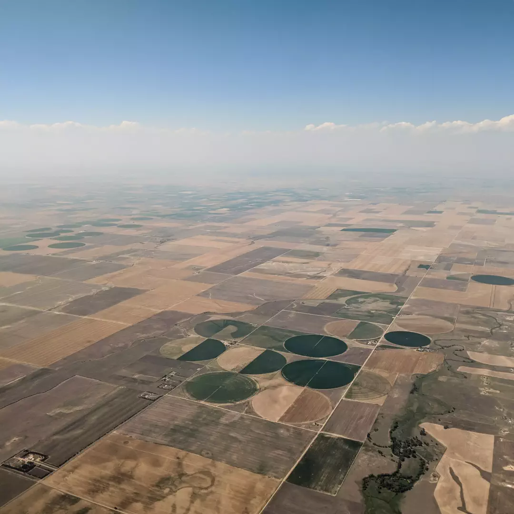

Eastern Colorado from the air, on the way to New York City and HOPE 12.

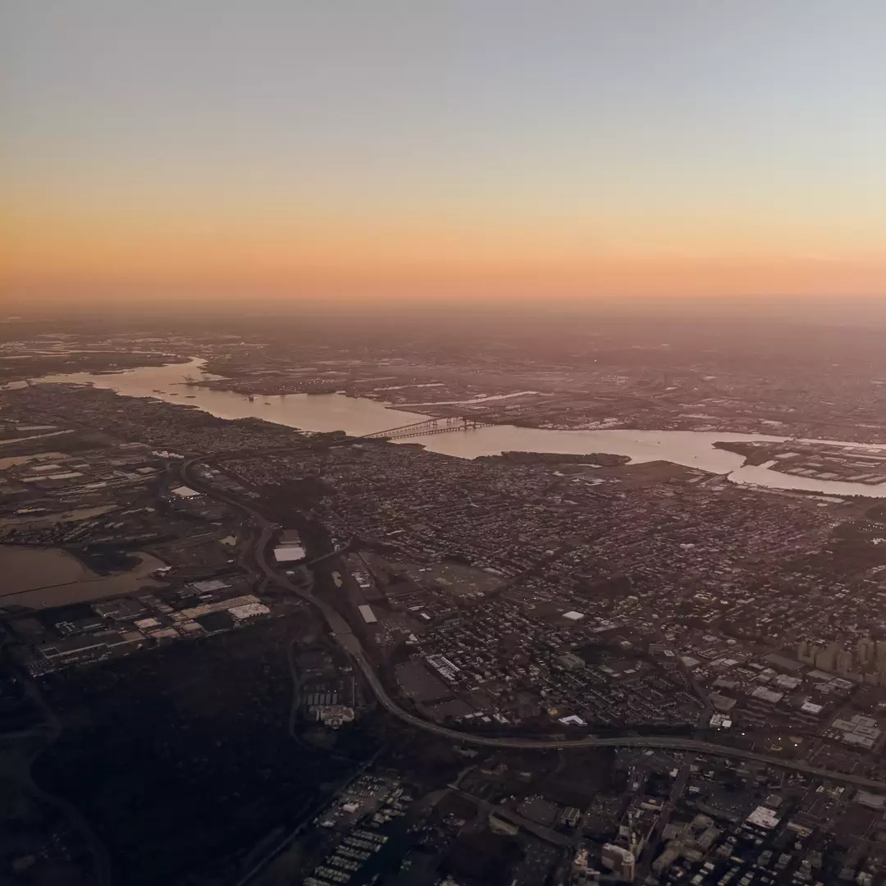

Jersey City from the air, just before landing in New York City for [HOPE 12](https://xii.hope.net/)!

## The Hotel Pennsylvania

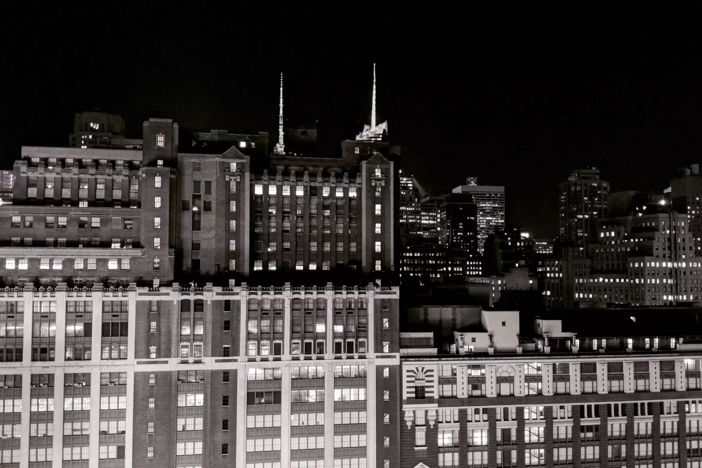

The view out the window of my room at the Hotel Pennsylvania, the night before HOPE 12.

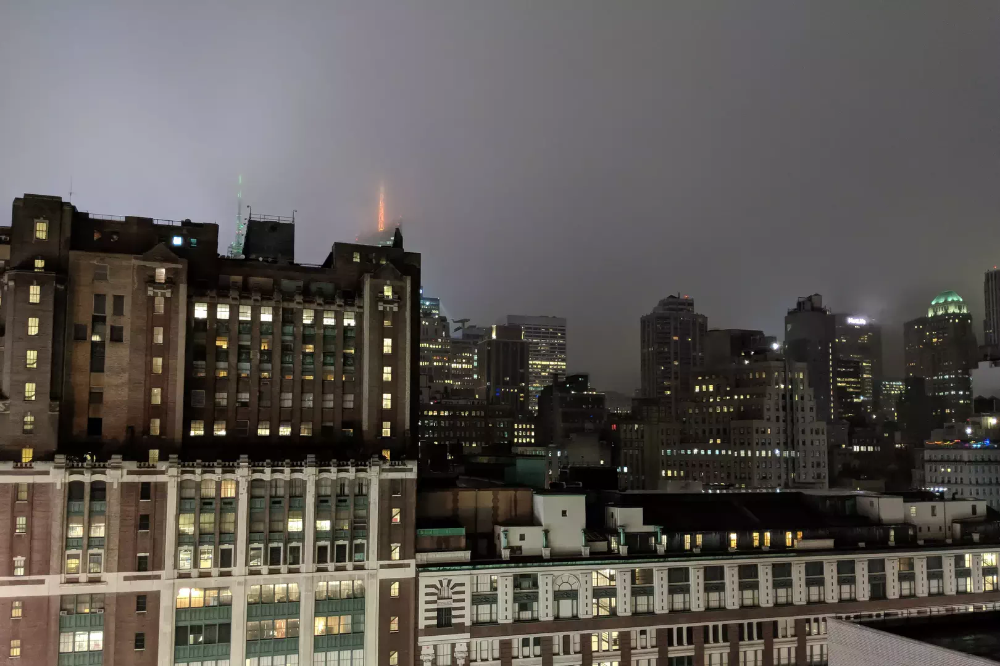

The view out the window of my room at the Hotel Pennsylvania on the second night of [HOPE 12](https://xii.hope.net/).

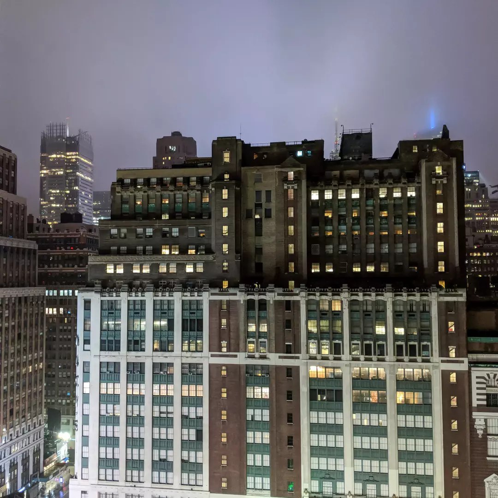

The view out the window of my room at the Hotel Pennsylvania on the second night of HOPE 12.

## The Metropolitan Museum of Art

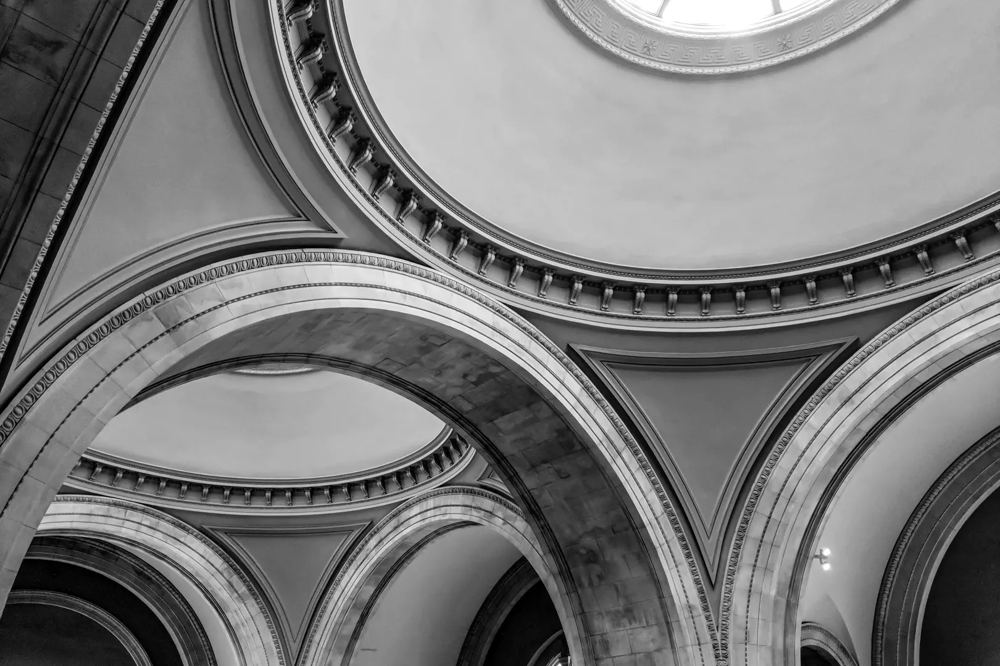

The ceiling of The Great Hall at the Metropolitan Museum of Art in New York City.

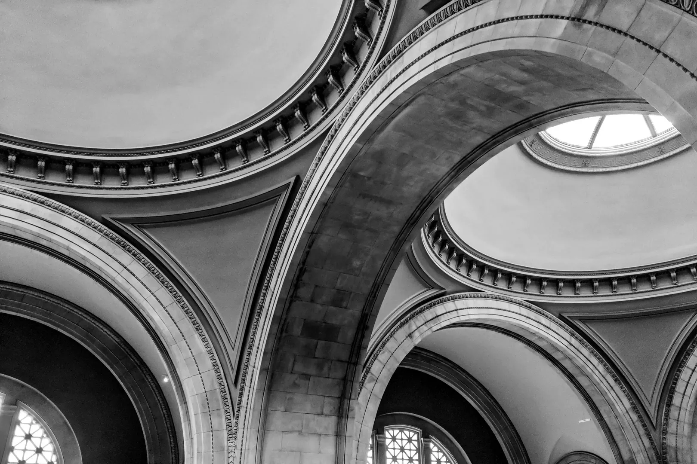

The ceiling of The Great Hall at the Metropolitan Museum of Art in New York City.

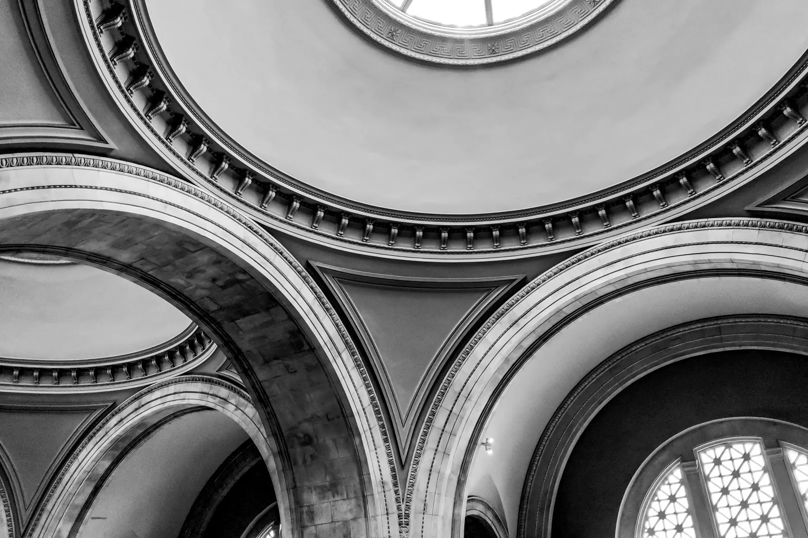

The ceiling of The Great Hall at the Metropolitan Museum of Art in New York City.

- - - -

👤 Nathan Acks  
📅 July 23, 2018
