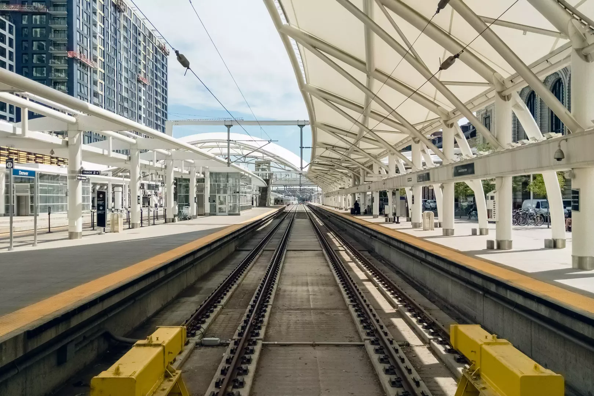
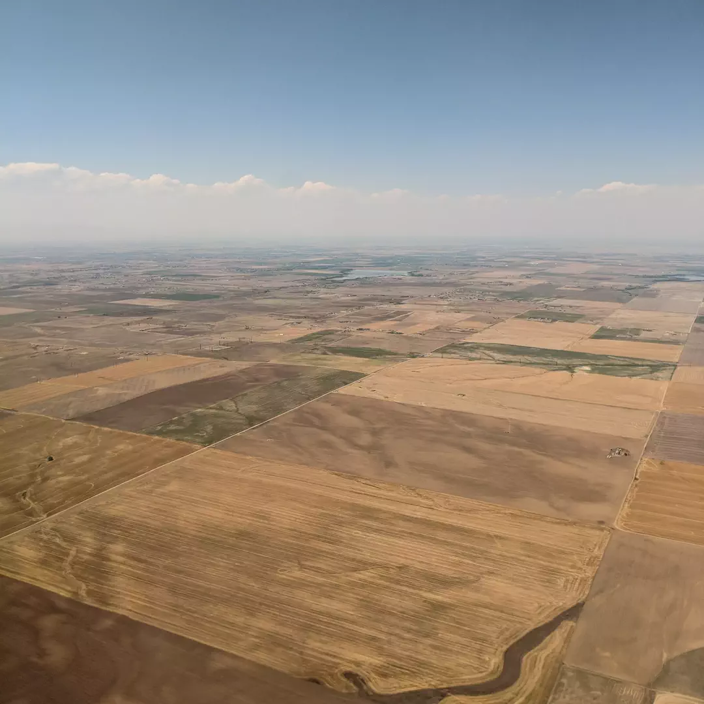
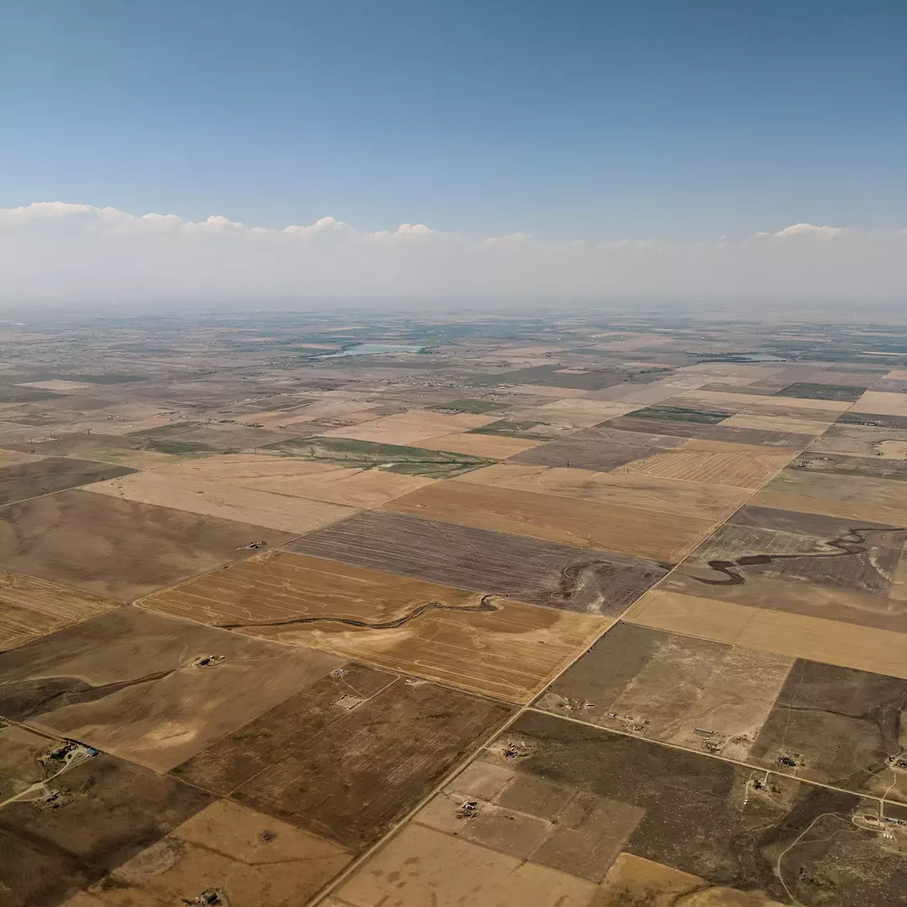
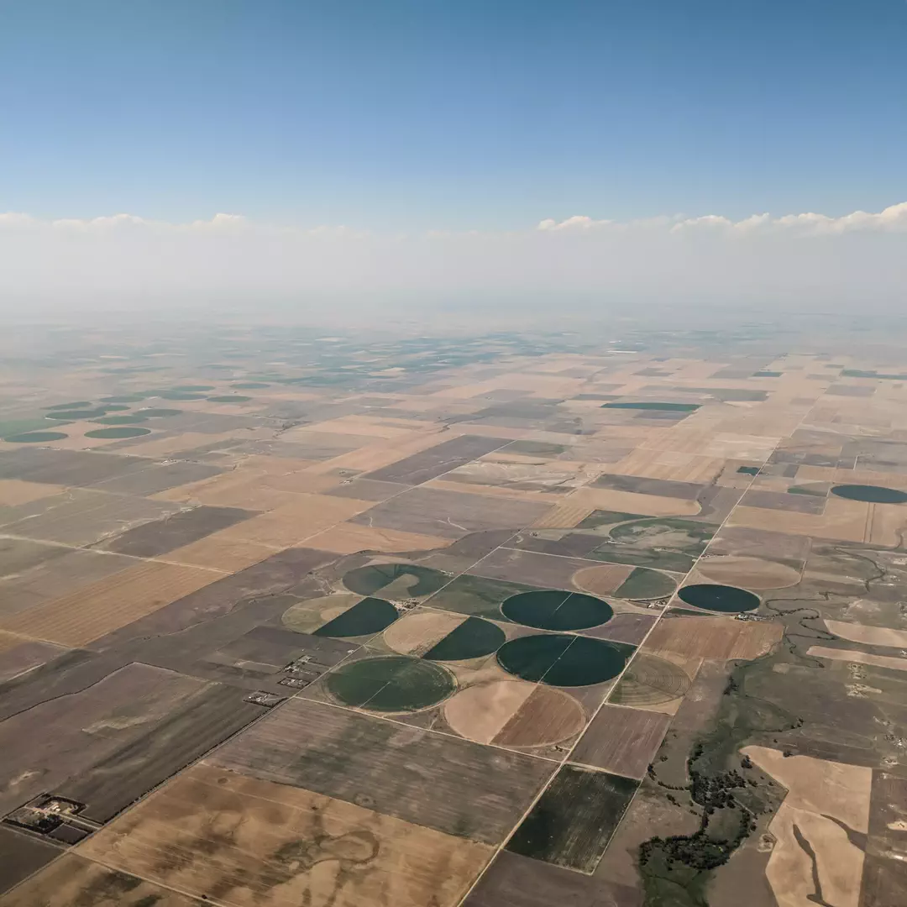
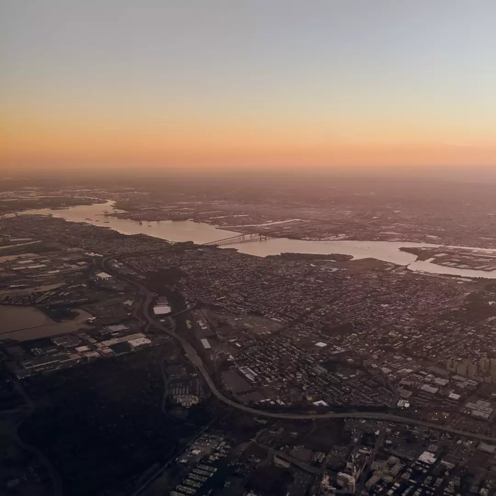
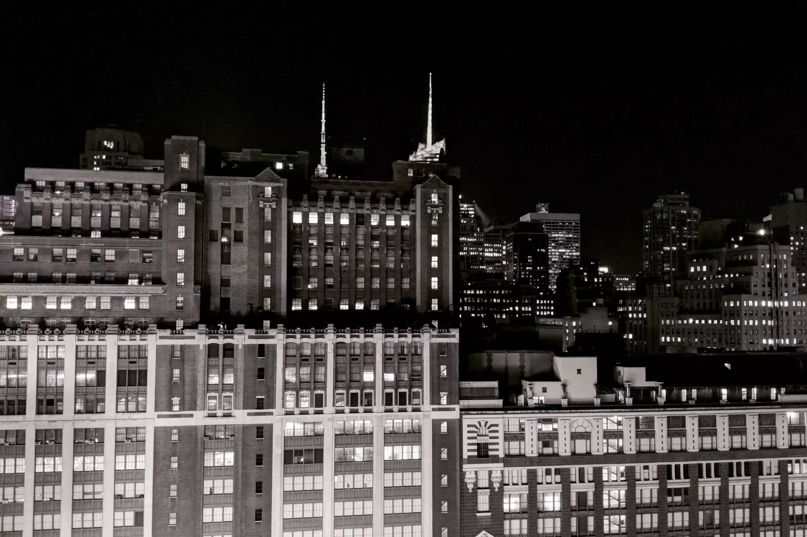
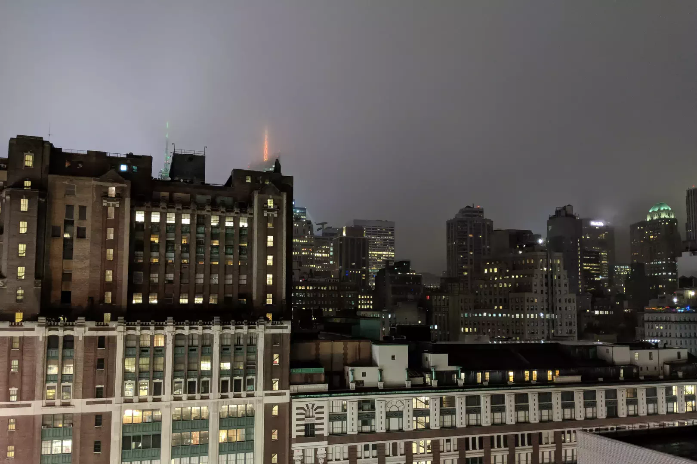
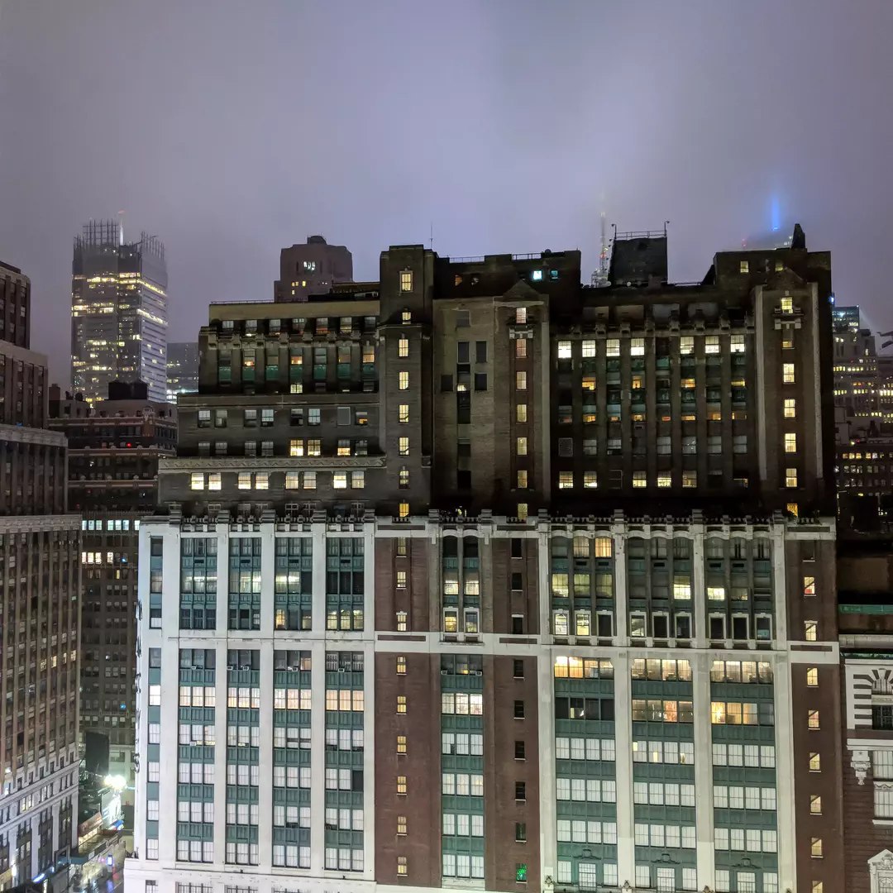
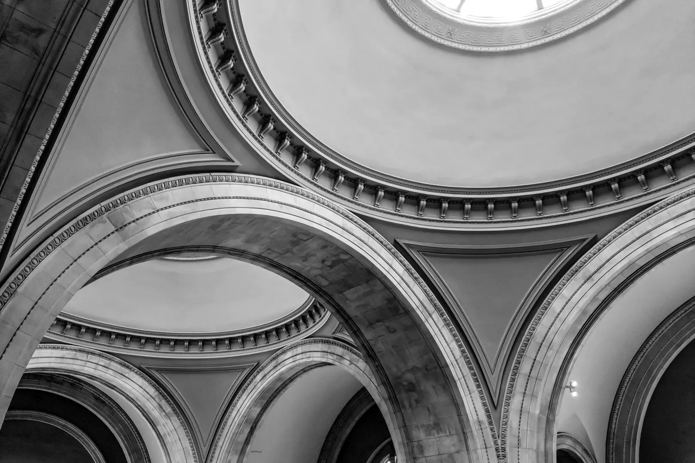
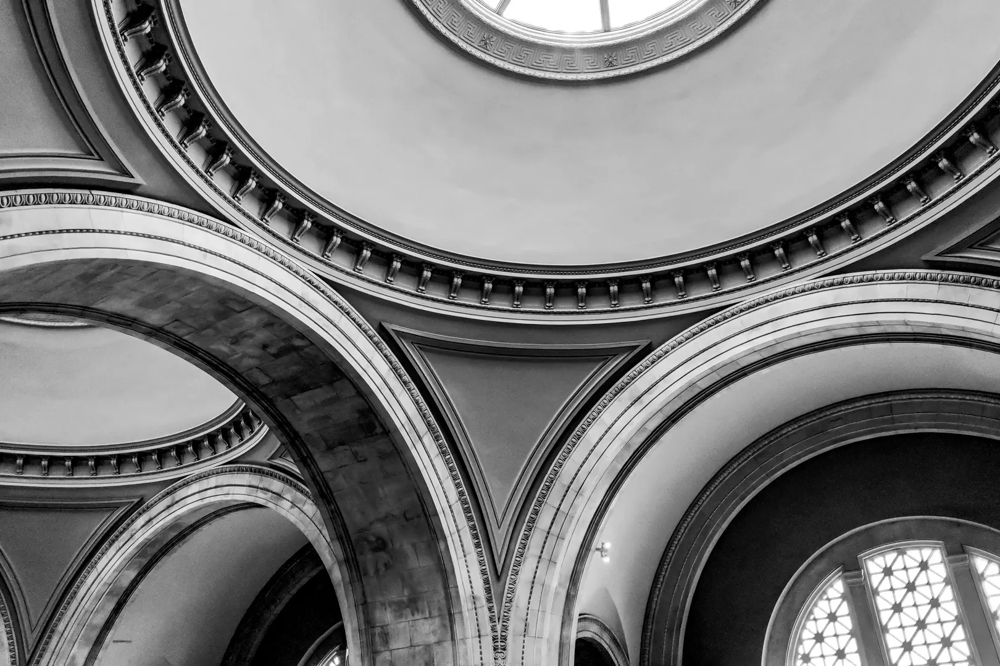

# The Circle of HOPE

photographer:: Nathan Acks  
date:: 2018-07-23

This year I attended HOPE 12, The Circle of HOPE. “HOPE” stands for “Hackers on Planet Earth”, and is one of the older hacker conferences in the US. It’s put on every other year by the crew from 2600 Magazine.

Attending HOPE is something I’ve wanted to do for a long time. While I didn’t take any photos in the conference itself, these are a few photos I took around the event.

* [The Circle of HOPE](https://xii.hope.net/)
* [2600: The Hacker Quarterly](https://www.2600.com/)

# Denver to New York

Union Station, Track A, on the way to HOPE 12!

Eastern Colorado from the air, on the way to New York City and HOPE 12.

Eastern Colorado from the air, on the way to New York City and HOPE 12.

Eastern Colorado from the air, on the way to New York City and HOPE 12.

Jersey City from the air, just before landing in New York City for HOPE 12!

* [The Circle of HOPE](https://xii.hope.net/)

## The Hotel Pennsylvania

The view out the window of my room at the Hotel Pennsylvania, the night before HOPE 12.

The view out the window of my room at the Hotel Pennsylvania on the second night of HOPE 12.

The view out the window of my room at the Hotel Pennsylvania on the second night of HOPE 12.

* [The Circle of HOPE](https://xii.hope.net/)

## The Metropolitan Museum of Art

The ceiling of The Great Hall at the Metropolitan Museum of Art in New York City.

The ceiling of The Great Hall at the Metropolitan Museum of Art in New York City.

The ceiling of The Great Hall at the Metropolitan Museum of Art in New York City.
