# October Adventures

Photos from October 2018: Hiking with friends, a work trip to Boston, and a mid-Fall meander around Denver.

## 16th Street Mall

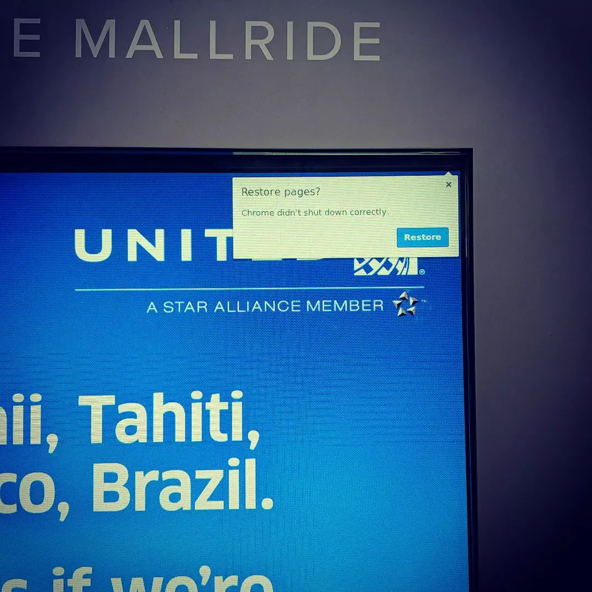

Oops.

## Red Rocks

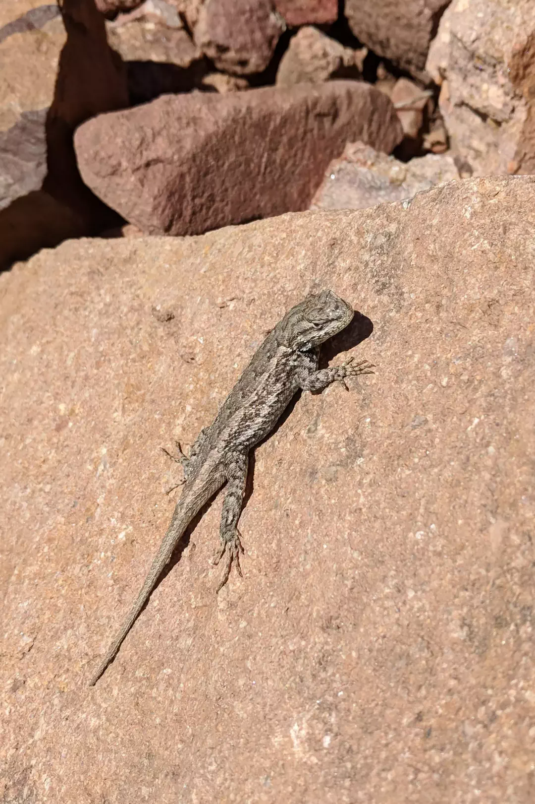

A lizard suns itself on a trail near Red Rocks.

Animated GIF.

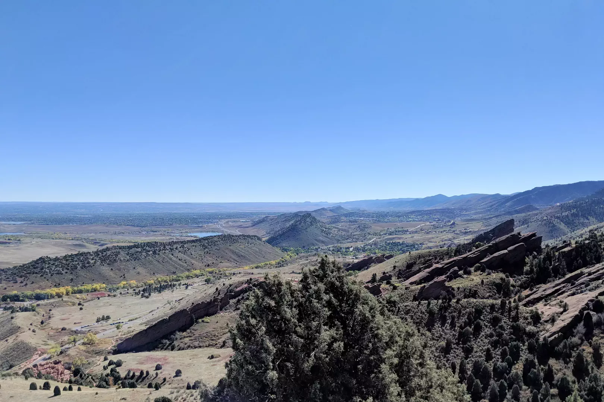

Looking southeast from a trail near Red Rocks towards the hogback. The amphitheater itself is actual not visible in this photograph, though some nearby rock formations can be seen on the far right of the image.

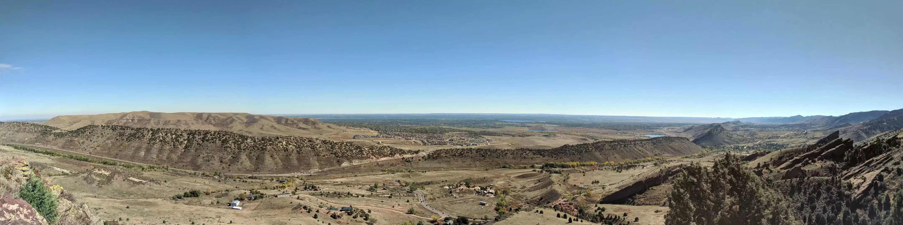

Looking east from a trail near Red Rocks. The amphitheater itself is actual not visible in this panorama, though some nearby rock formations can be seen on the far right of the image.

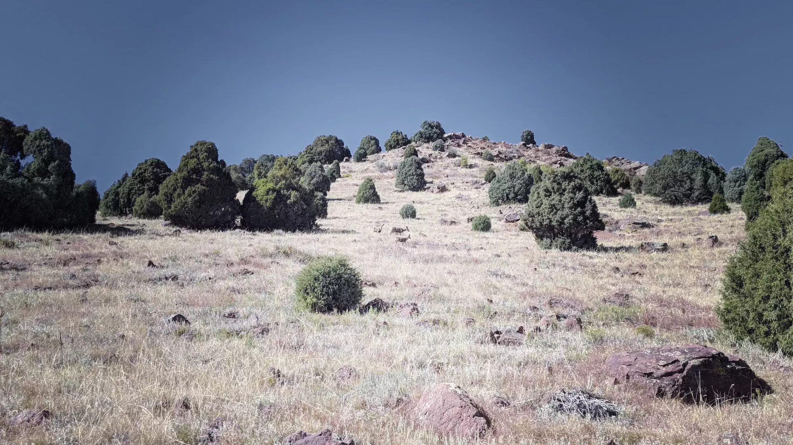

Deer near Red Rocks amphitheater.

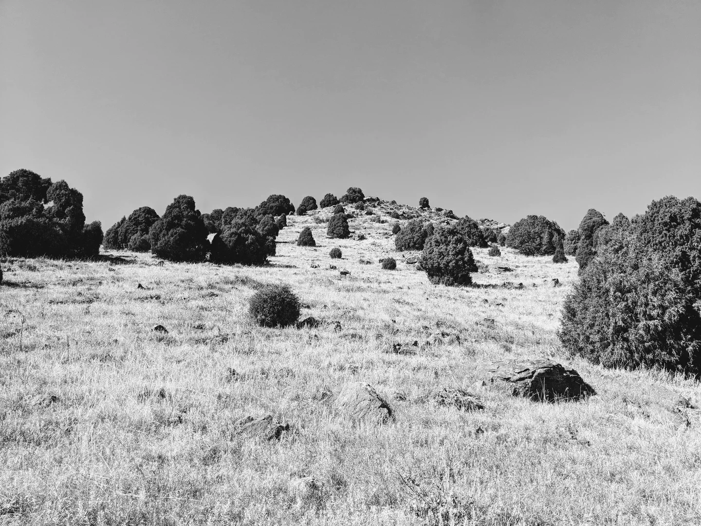

Deer near Red Rocks amphitheater.

## Boston

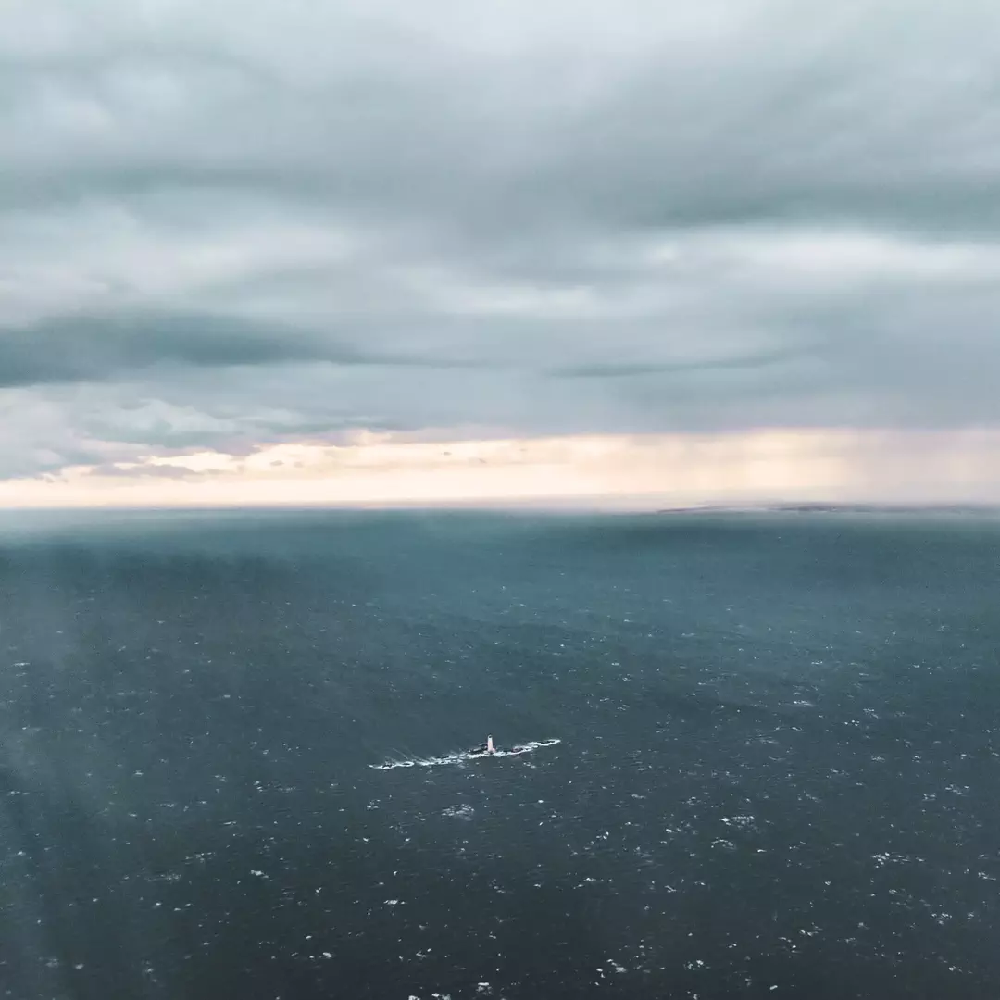

A lighthouse near Boston, Massachusetts, as seen on approach to Logan International Airport.

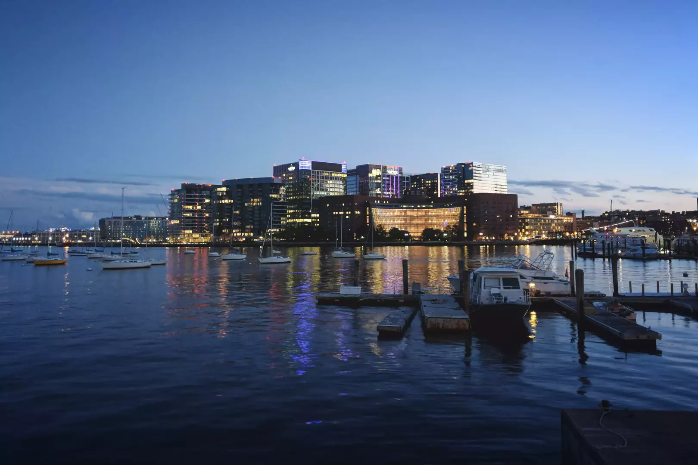

The view from the Boston Aquarium.

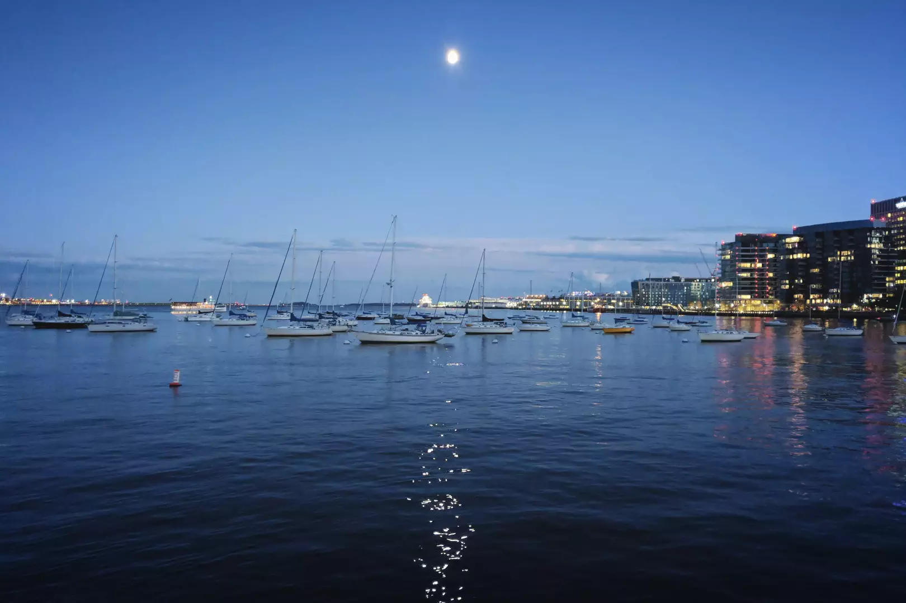

The Moon over Boston’s harbor, as seen from near the Boston Aquarium.

Departing Boston.

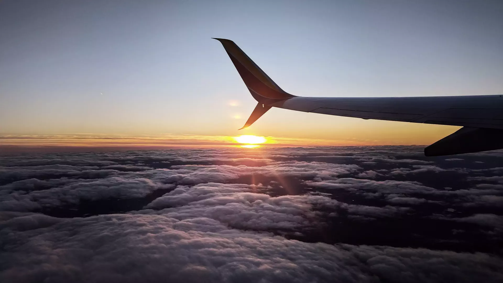

Sunset over western Massachusetts.

## Denver

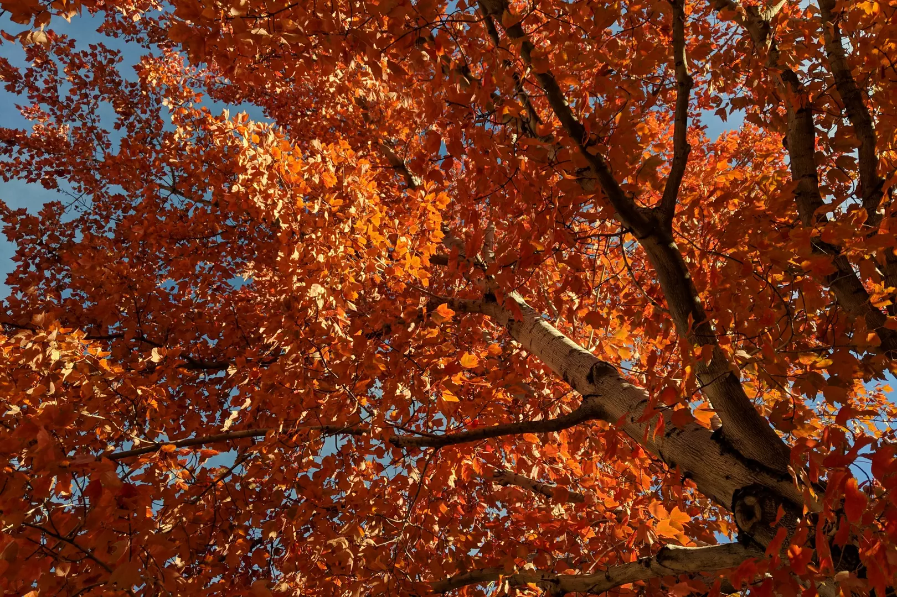

Fall colors in Denver.

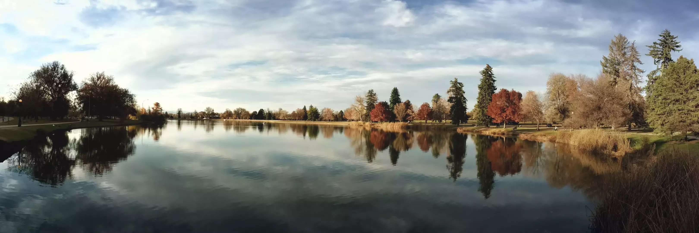

Fall colors in Denver’s City Park.

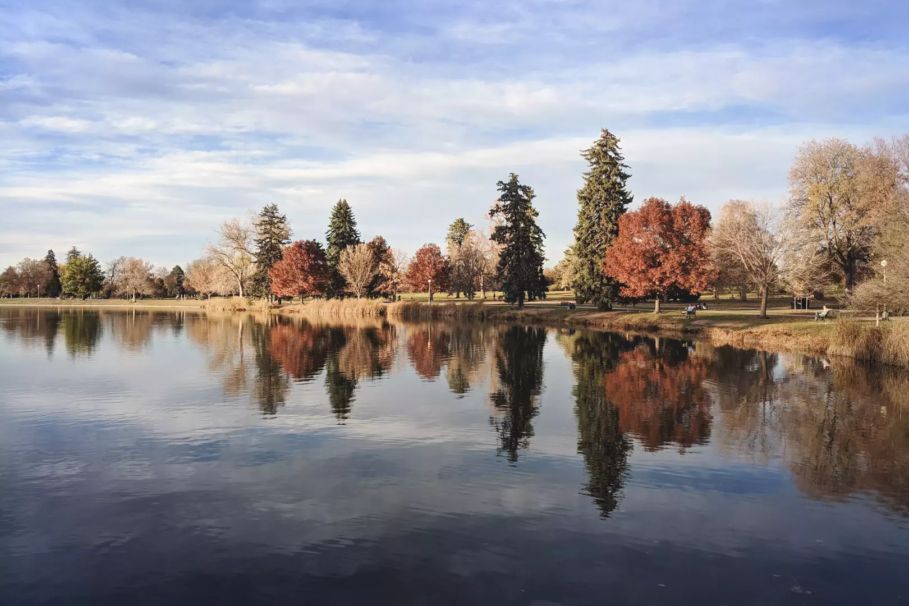

Fall colors in Denver’s City Park.

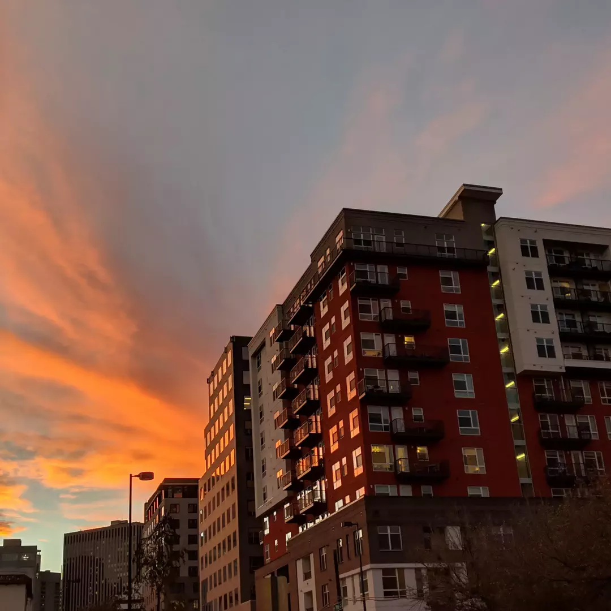

Sunset near 18th & Logan in Denver.

- - - -

👤 Nathan Acks
📅 October 28, 2018
