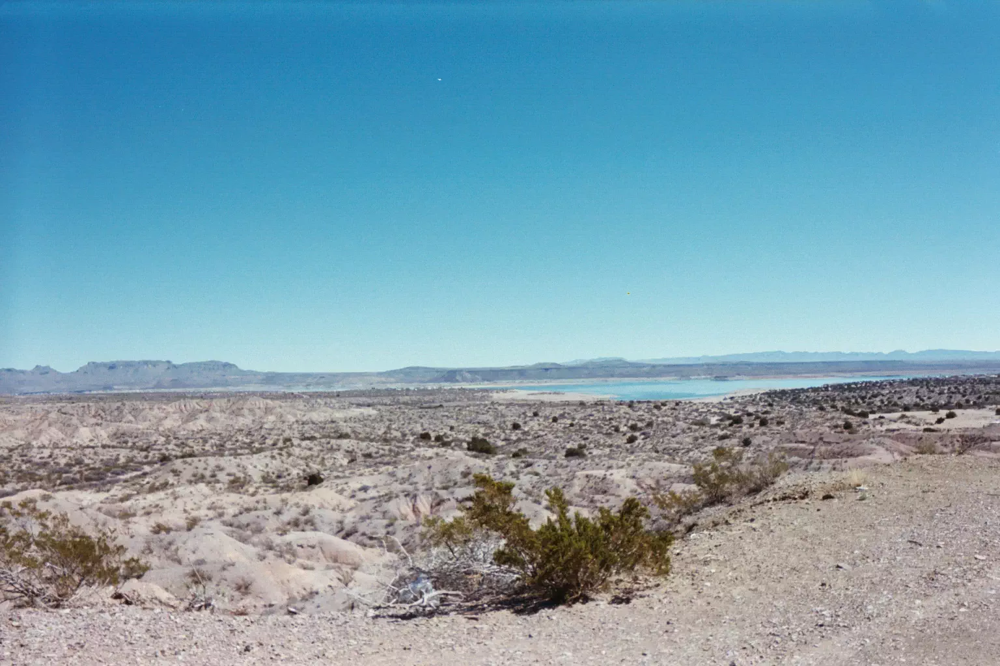

# Elephant Butte

This photo was taken just outside of Elephant Butte, New Mexico. My first real girlfriend had just suddenly broken up with me, and I basically lost my mind, dropped out of college, and decided to drive to California to see the ocean.

I left with $300, a jar of peanut butter, a loaf of bread, a full tank of gas, my Honda Civic, a sleeping bag, and the clothes on my back.

I took this photograph on a crappy instant camera on the second day of my outbound trip. It was the first real photograph I ever took for myself.

- - - -

👤 Nathan Acks  
📅 March 8, 2003
