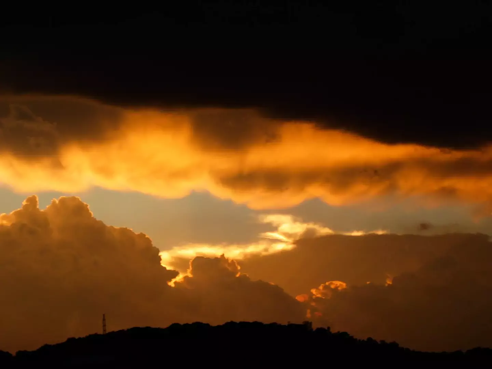

# The Brightness Reef

During the drive back from Chicago to Denver, Corrine and I were caught in a massive storm (probably somewhere in Nebraska). I’m certain that it spawned at least one tornado, and that it passed *very* close to where I’d pulled the car off the road. I’m sorry to say that I did *not* remain level-headed during the emergency.

Fortunately, whatever it was passed, and then the storm lifted rather quickly and we continued on our way. As the clouds broke, one of us (I think it was me, but can’t quite remember) snapped this picture.

The brightness reef.

- - - -

👤 Nathan Acks  
📅 August 10, 2003
