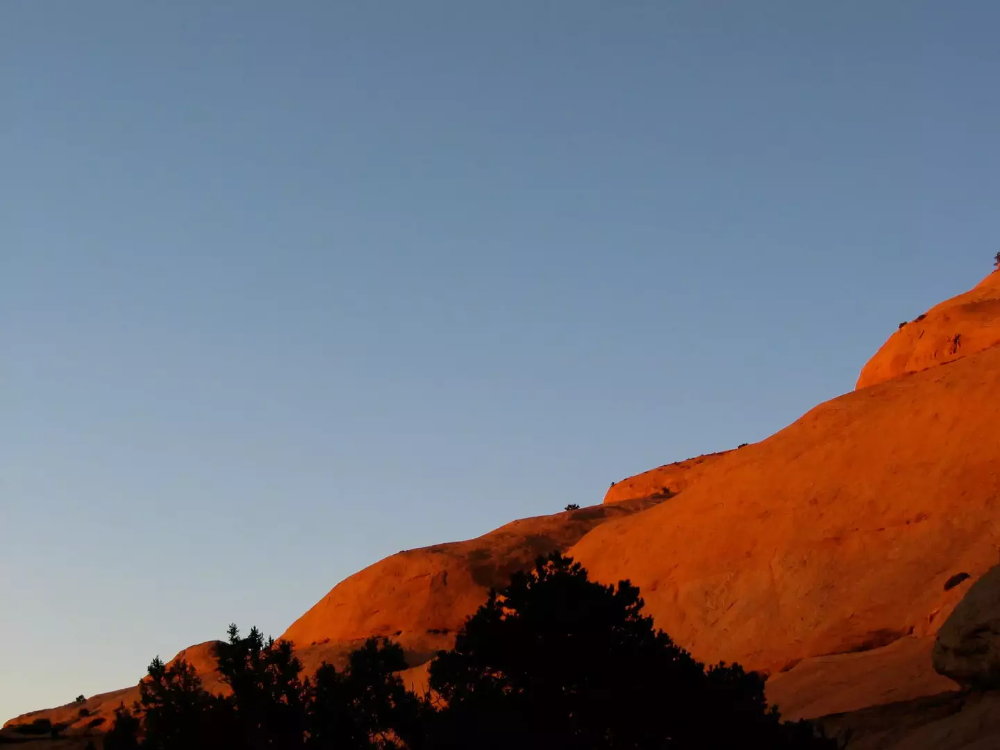

# Moab Sunset

A solid, rocky rise on a mesa southwest of Moab glows in in the setting Sun. What you can’t see here is all of the bats that were also flying around when I took this picture.

- - - -

👤 Nathan Acks  
📅 August 30, 2003
