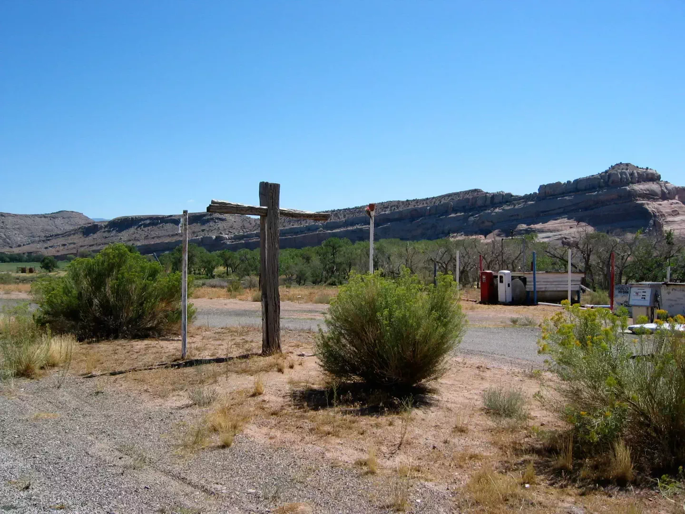

# Mad Max

* **photographer**:: Nathan Acks
* **date**:: 2003-08-31

Simon Vox advised me to take Highway 128 back to I-70 when leaving Moab for Denver, rather than heading directly back. The first part of that drive is an absolutely gorgeous canyon, but then as you get closer to I-70 the terrain transforms into the blasted post-apocalyptic moonscape that seems to make up most of northeastern Utah.

And then, beside the road, with nothing else around it, was the gas station. Not functional, mind you. And surrounded by crosses. Some big. Some small. Made with varying degrees of care, mostly out of branches and long-dead wood, but some out of metal pipes.

There was no one around to be seen.

It was like something out of a "Mad Max" movie, or perhaps the beginning of some twisted horror/thriller.

Worth seeing, but I didn't stay long (for obvious reasons).
