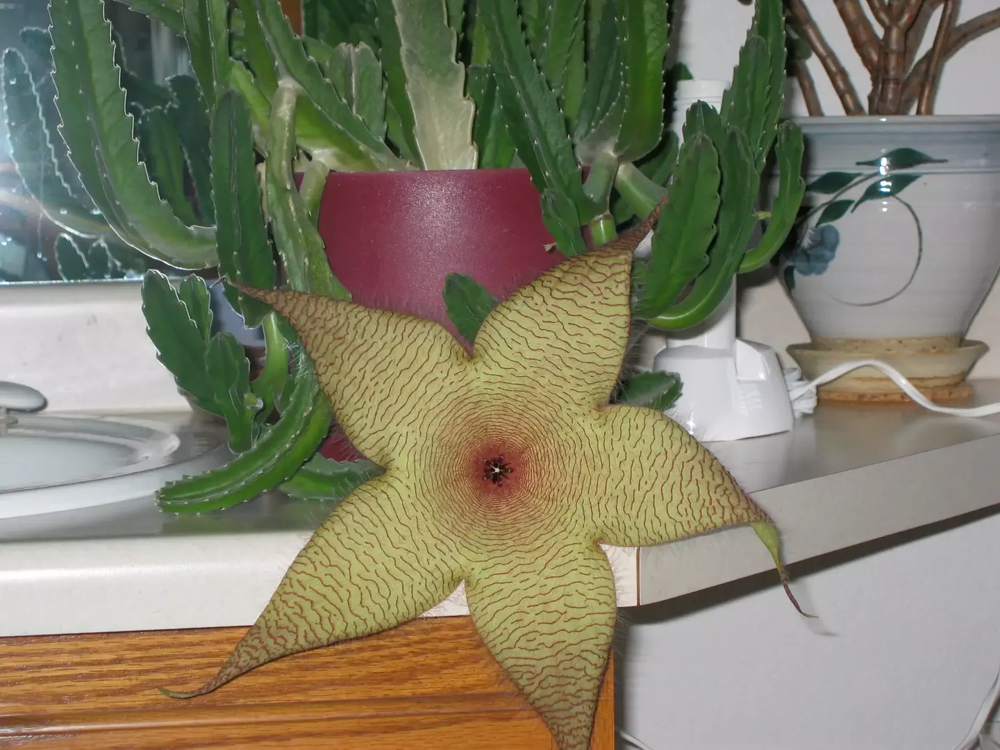

# Pollinated by Flies

* **photographer**:: Nathan Acks  
* **date**:: 2003-09-26

My folks had a South African cactus, which to my knowledge has only flowered one time. This is what we got - not the delicate, sweet-smelling cactus flowers that you see here in the American West, but rather a putrid-looking thing almost the size of a dinner plate with a truly awful smell.

Definitely pollinated by flies.

* [Stapelia gigantea (Wikipedia)](https://en.m.wikipedia.org/wiki/Stapelia_gigantea)
