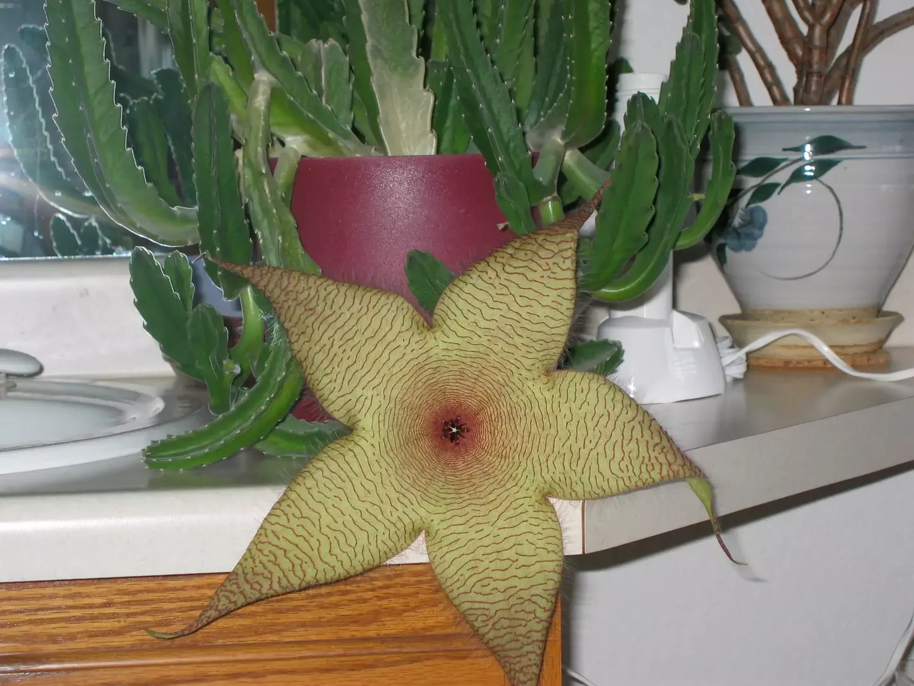

# Pollinated by Flies

My folks had a South African cactus ([Stapelia gigantea](https://en.m.wikipedia.org/wiki/Stapelia_gigantea)), which to my knowledge has only flowered one time. This is what we got — not the delicate, sweet-smelling cactus flowers that you see here in the American West, but rather a putrid-looking thing almost the size of a dinner plate with a truly awful smell.

Definitely pollinated by flies.

- - - -

👤 Nathan Acks  
📅 September 26, 2003
