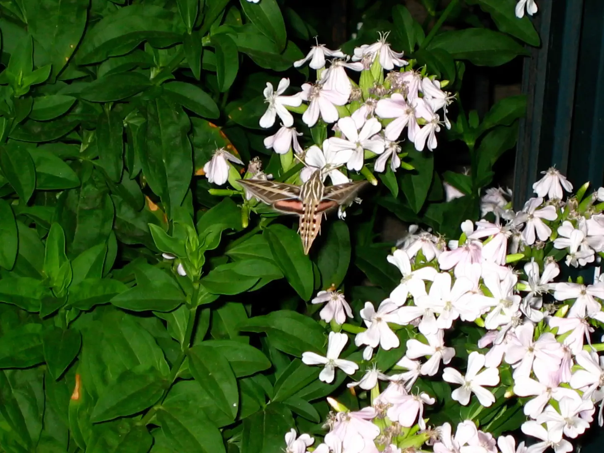

# Hummingbird Moth

photographer:: Nathan Acks  
date:: 2005-07-10

While walking to the Penn Street Perk to meet up with Stacie Wilcox, I happened upon what I can only describe as a swarm of hummingbird moths feeding near the southwest corner of 13th & Pennsylvania. They were gone almost as soon as I began taking pictures, but I managed to get a couple of good shots.
