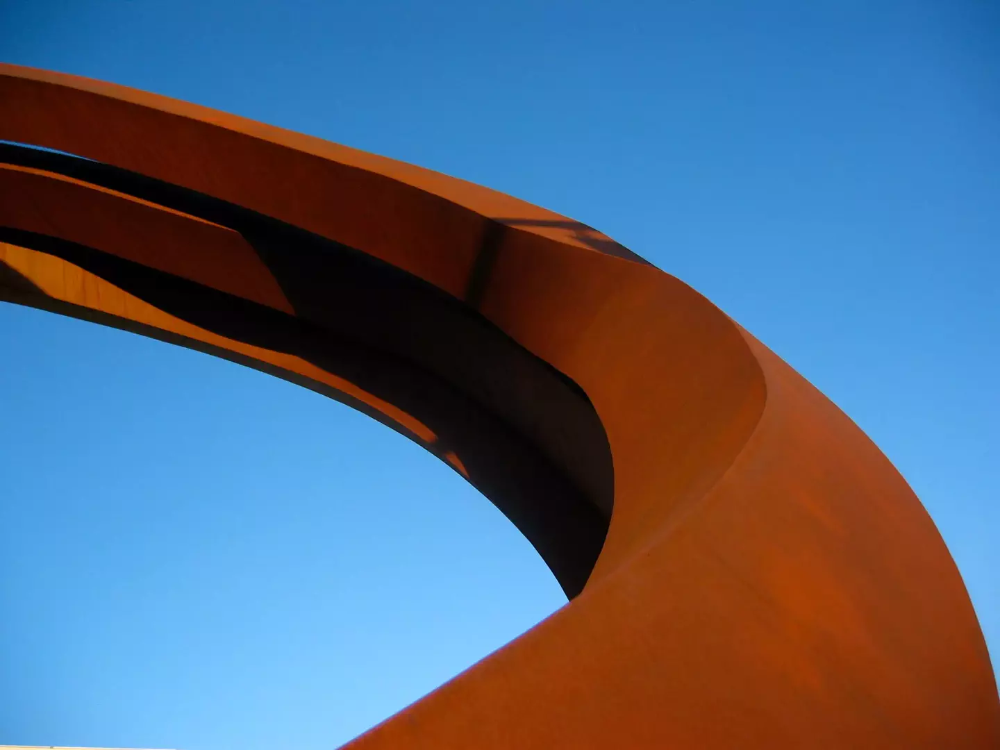

# Rust & Sky

Part of a series of metal sculptures that used to be located in the small park between the [Denver Performing Arts Complex](http://www.denvercenter.org/) and Speer. This is my favorite of all the pictures I took that day; I really like the way that the ring feels like it’s in motion.

- - - -

👤 Nathan Acks
📅 July 13, 2005
