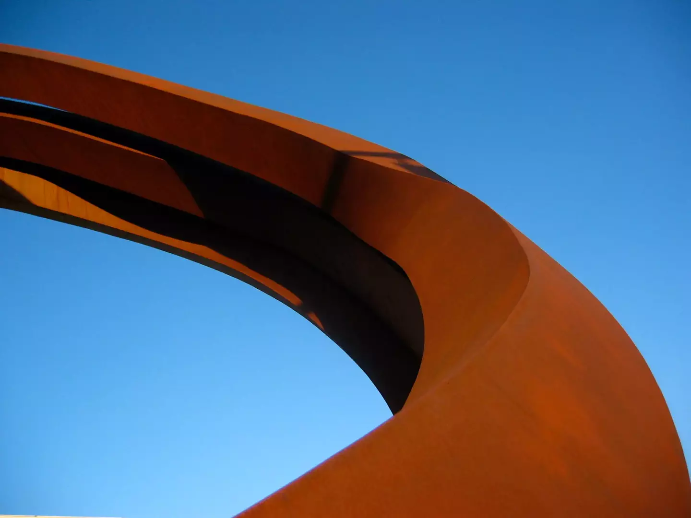

# Rust & Sky

**photographer**:: Nathan Acks  
**date**:: 2005-07-13

Part of a series of metal sculptures that used to be located in the small park between the Denver Performing Arts Complex and Speer. This is my favorite of all the pictures I took that day; I really like the way that the ring feels like it's in motion.

* [Denver Center for the Performing Arts](http://www.denvercenter.org/)
