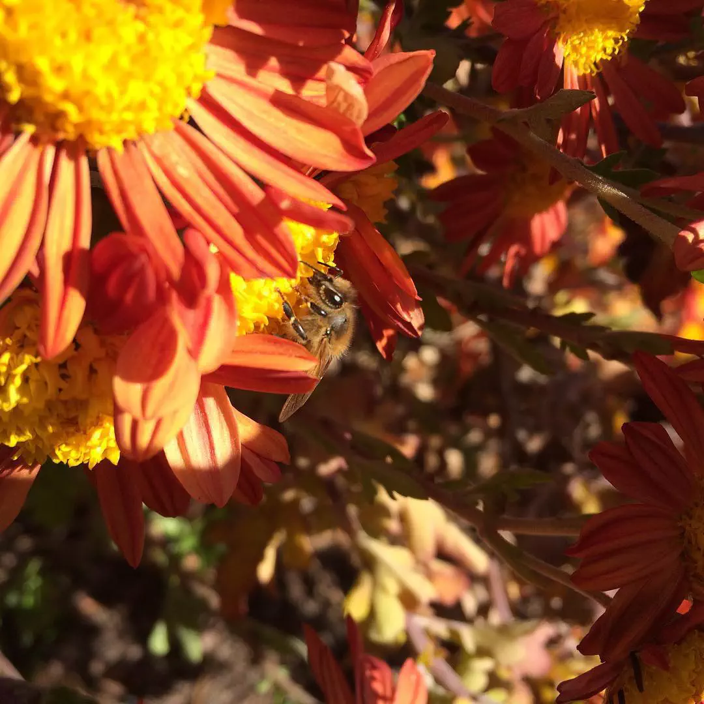

# The Last Honey Bee

Near the lily pond lies a small clump of red and orange flowers, dying from the frost but still fragrant.

The last honey bees (and a few smaller native bees) were here, searching for what nectar remained before the winter truly set in.

- - - -

👤 Nathan Acks
📅 November 15, 2015
