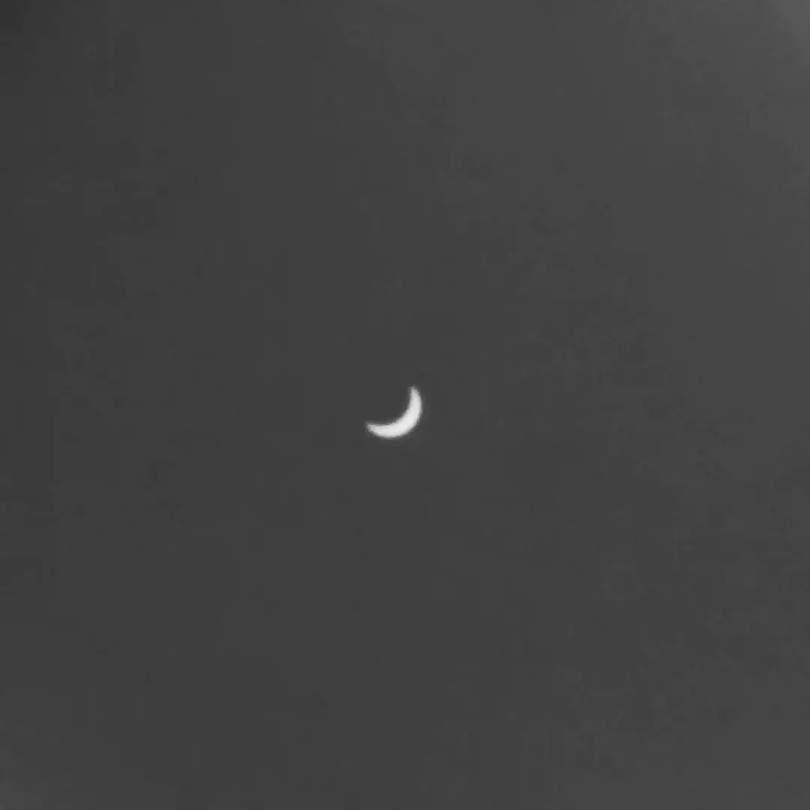

# Solar Eclipse

The 2017 solar eclipse as seen from Denver, near the eclipse maxima. This is actually a picture of an image of the Sun (and the Moon, really, but you can’t see that) projected on a paper plate using a pinhole setup devised by John Michael Watkins.

- - - -

👤 Nathan Acks  
📅 August 21, 2017
