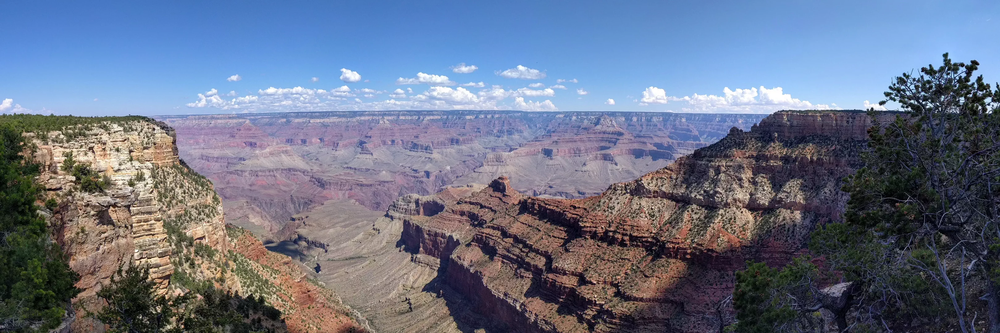

# Yaki Point

Looking towards Yaki Point from the Grand Canyon visitor center. Len Montgomery and I hiked later to the Cedar Ridge overlook on the South Kaibab Trail, just above the “temple” in this photo.

- - - -

👤 Nathan Acks
📅 September 12, 2017
