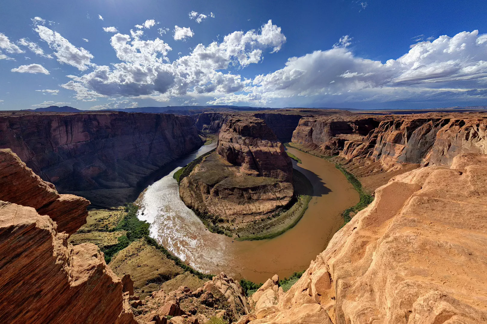

# Horsehoe Bend

Horseshoe Bend is in Grand Canyon National Park (the park begins at the top of the rim walls and extends to the Glen Canyon Dam), but the overlook I’m on is BLM land.

- - - -

👤 Nathan Acks  
📅 September 14, 2017
