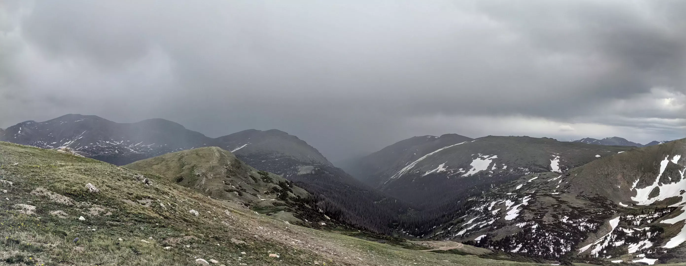

# Mountain Valley

Looking southeast from the [Rocky Mountain National Park](https://www.nps.gov/romo/index.htm) Alpine Visitor Center down the Fall River Valley. Mount Chapin frames the valley to the left, while Sundance Mountain borders the valley on the right. Marmot Point can be seen just left of the center of the image; Mount Chiquita and Ypsilon Peak can be seen to its left.

- - - -

👤 Nathan Acks
📅 June 16, 2018
