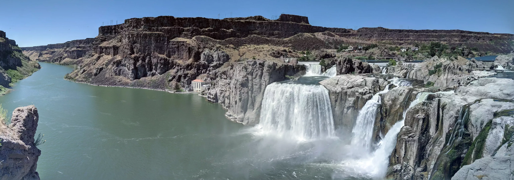

# Shoshone Falls

Shoshone Falls along the Snake River. The tall red-roofed building at center-left is a small hydroelectric power plant (as is the smaller gray building adjoining it to the right).

- - - -

👤 Nathan Acks
📅 June 26, 2018
