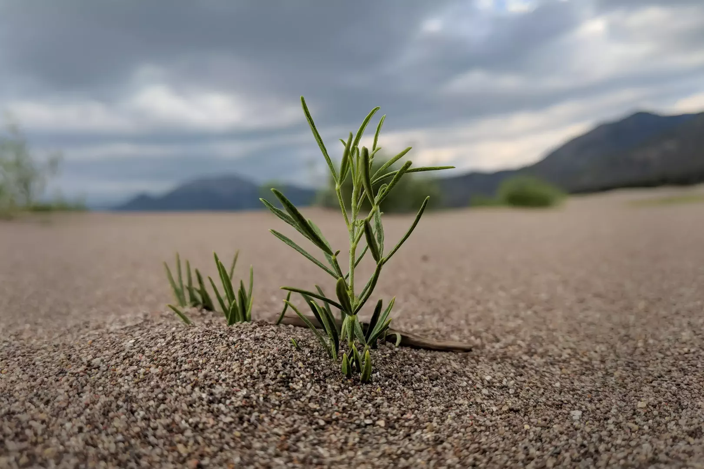

# Seedling

A seedling growing near the eastern edge of the Great Sand Dunes. Mount Herard can be seen in the distance at left, and Mount Zwischen in the distance at far-right.

- - - -

👤 Nathan Acks  
📅 July 7, 2018
